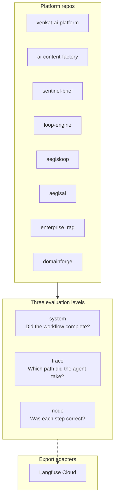

# AI Architecture Portfolio


<!-- vpeetla-tech-stack:start -->
[]() []() []()
<!-- vpeetla-tech-stack:end -->
## Agent skills (Cursor + Codex)

Org skills: [vpeetla-ai-skills](https://github.com/vpeetla-ai/vpeetla-ai-skills). This repo includes `.cursor/skills/`, `AGENTS.md`, and `CONTEXT.md`.

```bash
git clone https://github.com/vpeetla-ai/vpeetla-ai-skills.git
./vpeetla-ai-skills/scripts/install.sh --cursor --codex --project .
```

---

### Production-grade governed agent systems — architecture, decisions, and measurable outcomes

[](LICENSE)
[](https://venkat-ai.com/work)
[](https://www.linkedin.com/in/venkata-peetla/)

---

**Venkata Peetla** — Principal AI Architect · Lucid Motors  
*19 years enterprise delivery · **17 live demos** · **23 open-source repos**

[Live demos](https://venkat-ai.com/work) · [Repo index](docs/REPO_INDEX.md) · [LinkedIn launch plan](docs/LINKEDIN_LAUNCH_PLAN.md) · [Trace-linked observability](docs/TRACE_LINKED_OBSERVABILITY.md) · [README standard](docs/README_STANDARD.md) · [Executive brief](https://venkat-ai.com/profile/executive-brief) · [GitHub org](https://github.com/vpeetla-ai) · [Improvement plan 2026](docs/ORG_IMPROVEMENT_PLAN_2026.md) · [Top-1% 90-day backlog](docs/TOP1PCT_90DAY_BACKLOG.md)

---

## Impact at a Glance

| **10→2** | **Multi-$M** | **17 live demos** | **8-layer stack + skills** |
|----------|--------------|---------------------|---------------------------|
| Agent ops staffing reduction (targeted supply-chain flows) | Revenue & savings — payments, subscriptions, EDI | Platform + pattern demos on Vercel/Render | Wired together — [improvement plan](docs/ORG_IMPROVEMENT_PLAN_2026.md) |

---

## Governed AI Reference Stack

Questions every enterprise agent program must answer — each mapped to a live repo and demo.

| # | Question | System | Live demo | Source |
|---|----------|--------|-----------|--------|
| 1 | What should agents do? | **Venkat AI Platform** — multi-agent OS | [venkat-ai-platform.vercel.app](https://venkat-ai-platform.vercel.app) | [venkat-ai-platform](https://github.com/vpeetla-ai/venkat-ai-platform) |
| 2 | What are agents allowed to do? | **AegisAI** — gateway, policy, HITL, audit | [aegisai-enterprise-agent-platform.vercel.app](https://aegisai-enterprise-agent-platform.vercel.app) | [aegisai](https://github.com/vpeetla-ai/aegisai-enterprise-agent-platform) |
| 3 | What knowledge can they use? | **Enterprise RAG** — access-before-ranking | [enterprise-rag-platform-eta.vercel.app](https://enterprise-rag-platform-eta.vercel.app) | [enterprise_rag_platform](https://github.com/vpeetla-ai/enterprise_rag_platform) |
| 3b | How do we adapt domain format? | **DomainForge** — RAG facts + PEFT behavior | [domainforge-rag-peft.vercel.app](https://domainforge-rag-peft.vercel.app) · [API](https://domainforge-api.onrender.com) | [domainforge-rag-peft](https://github.com/vpeetla-ai/domainforge-rag-peft) |
| 3c | How do we run voice triage? | **VoiceForge** — ASR → LLM → TTS | [voiceforge-assistant.vercel.app](https://voiceforge-assistant.vercel.app) · [API](https://voiceforge-api-eysb.onrender.com) | [voiceforge-assistant](https://github.com/vpeetla-ai/voiceforge-assistant) |
| 4 | How do we operate agent fleets? | **AegisLoop** — missions, traces, eval gates | [aegisloop-agentops-workbench.vercel.app](https://aegisloop-agentops-workbench.vercel.app) | [aegisloop](https://github.com/vpeetla-ai/aegisloop-agentops-workbench) |
| 5 | What do they produce? | **AI Content Factory** — governed publish pipeline | [ai-content-factory-iota.vercel.app](https://ai-content-factory-iota.vercel.app) | [ai-content-factory](https://github.com/vpeetla-ai/ai-content-factory) |
| 6 | **How do agents improve?** | **LoopForge** — LangGraph repo fix → PR, harness, memory | [demo-omega-taupe.vercel.app](https://demo-omega-taupe.vercel.app) · [API](https://loopforge-api.onrender.com) | [loop-engine-agent-platform](https://github.com/vpeetla-ai/loop-engine-agent-platform) |
| 7 | **How do we serve LLMs?** | **vLLM Architecture Lab** — PagedAttention, batching, KV budget | [vllm-architecture-lab.vercel.app](https://vllm-architecture-lab.vercel.app) · [API](https://vllm-architecture-lab-api.onrender.com) | [vllm-architecture-lab](https://github.com/vpeetla-ai/vllm-architecture-lab) |
| 8 | **What did agents cost?** | **Agent FinOps** — metering, budgets, breach halt | [agent-finops.vercel.app](https://agent-finops.vercel.app) · [API](https://agent-finops-api.onrender.com) | [agent-finops](https://github.com/vpeetla-ai/agent-finops) |
| 9 | **Overnight signal?** | **Sentinel Brief** — allowlisted sources → eval gate → governed email | [sentinel-brief-ruddy.vercel.app](https://sentinel-brief-ruddy.vercel.app) | [sentinel-brief](https://github.com/vpeetla-ai/sentinel-brief) |
| 10 | **Interview proof?** | **Practice Arena** — 35/35 playbook · 139/140 dual-judge calibration | [ai-architect-practice-arena.vercel.app](https://ai-architect-practice-arena.vercel.app) | [ai-architect-practice-arena](https://github.com/vpeetla-ai/ai-architect-practice-arena) |
| 11 | **Right model for this step?** | **OmniForge** — multimodal ask · multi-agent · multi-LLM waterfall | [omniforge-flame.vercel.app](https://omniforge-flame.vercel.app) · [API](https://omniforge-api.onrender.com) | [omniforge](https://github.com/vpeetla-ai/omniforge) |
| — | **How do we know it worked?** | **Trace-linked LLMOps** — system / trace / node evals → Langfuse or OTLP | [TRACE_LINKED_OBSERVABILITY.md](docs/TRACE_LINKED_OBSERVABILITY.md) | All platform APIs |

**Canonical essay:** [From Multi-Agent OS to Agent Governance](case-studies/from-multi-agent-os-to-agent-governance.md)

---

## Trace-linked LLMOps (observability layer)

Observability tells you **what happened**. Trace-linked evaluation tells you **whether it was good** — on the same `trace_id` as the agent run.



Spec: [docs/TRACE_LINKED_OBSERVABILITY.md](docs/TRACE_LINKED_OBSERVABILITY.md) · ADR: [ADR-007](adr/ADR-007-2026-agent-protocol-stack.md)

---

## Featured Case Studies

Each includes architecture context, key decisions, trade-offs, and links to live demos + source code.

### AI Reference Systems (open source)

| Project | Domain | Key outcome | Case study |
|---------|--------|-------------|------------|
| **VoiceForge** | Real-time multimodal | ASR → LLM → TTS · latency budgets · graceful degradation | [case-studies/voiceforge-assistant.md](case-studies/voiceforge-assistant.md) |
| **DomainForge** | RAG + PEFT MLOps | S0→S4 eval ladder — facts via RAG, behavior via QLoRA + DPO | [case-studies/domainforge-rag-peft.md](case-studies/domainforge-rag-peft.md) |
| **LoopForge** | Loop engineering | Self-improving harness — ODAEU, MCP, RAG tuning | [case-studies/loopforge-self-improving-harness.md](case-studies/loopforge-self-improving-harness.md) |
| **vLLM Architecture Lab** | LLM inference | PagedAttention · continuous batching · KV simulator | [vllm-architecture-lab/docs/ARCHITECTURE.md](https://github.com/vpeetla-ai/vllm-architecture-lab/blob/main/docs/ARCHITECTURE.md) |
| **AegisAI** | Agent governance | Runtime control plane — gateway, HITL, signed audit | [case-studies/aegisai-agent-governance.md](case-studies/aegisai-agent-governance.md) |
| **Venkat AI Platform** | Multi-agent orchestration | 3 LangGraph orchestrators · 7 RAG strategies | [case-studies/venkat-ai-platform.md](case-studies/venkat-ai-platform.md) |
| **Enterprise RAG** | Knowledge layer | Authorization before ranking · hybrid retrieval | [case-studies/enterprise-rag-platform.md](case-studies/enterprise-rag-platform.md) |
| **AegisLoop** | AgentOps | Mission fleets · eval gates · FinOps · Langfuse | [case-studies/aegisloop-agentops.md](case-studies/aegisloop-agentops.md) |
| **AI Content Factory** | Content automation | Research → drafts → HITL → governed publish | [case-studies/ai-content-factory.md](case-studies/ai-content-factory.md) |
| **Agent FinOps** | Cost governance | Shared metering ledger · budget breach halts dispatch | [case-studies/agent-finops.md](case-studies/agent-finops.md) |
| **Sentinel Brief** | Overnight intelligence | Allowlisted sources → snapshot diff → eval gate → governed email | [case-studies/sentinel-brief.md](case-studies/sentinel-brief.md) |
| **OmniForge** | Multimodal multi-LLM | Ask anything · agents + MCP · model waterfall proof | [case-studies/omniforge.md](case-studies/omniforge.md) |
| **Golden Eval Registry** | Evaluation | Cross-repo golden eval contracts | [case-studies/golden-eval-registry.md](case-studies/golden-eval-registry.md) |

### Enterprise Delivery (employer context)

| Project | Organization | Key outcome | Case study |
|---------|--------------|-------------|------------|
| **Enterprise Agentic AI** | Lucid Motors | 10→2 staffing in targeted supply-chain flows | [case-studies/enterprise-agentic-ai-lucid.md](case-studies/enterprise-agentic-ai-lucid.md) |
| **Gulf Payments Modernization** | Volvo Cars | Multi-$M annualized revenue impact | [case-studies/gulf-payments-modernization.md](case-studies/gulf-payments-modernization.md) |
| **Subscription Revenue Platform** | Volvo Cars | Durable recurring revenue platform | [case-studies/subscription-revenue-platform.md](case-studies/subscription-revenue-platform.md) |
| **Supply Chain EDI Re-Platforming** | Volvo Cars | Multi-$M annualized savings | [case-studies/supply-chain-edi-replatforming.md](case-studies/supply-chain-edi-replatforming.md) |

---

## Architecture Decision Records

Real decisions from production systems — not theoretical patterns.

| ADR | Topic | Key insight |
|-----|-------|-------------|
| [ADR-001](adr/ADR-001-orchestration-vs-governance-split.md) | Orchestration vs governance split | VAP + AegisAI as complementary layers — orchestration without governance is a liability |
| [ADR-002](adr/ADR-002-authorization-before-ranking-rag.md) | Authorization before ranking | RAG is an access-controlled intelligence layer, not a vector DB wrapper |
| [ADR-003](adr/ADR-003-mission-based-agentops.md) | Mission-based AgentOps | Bounded missions with eval gates — fleets survive production, not monolithic prompts |
| [ADR-004](adr/ADR-004-gateway-hitl-side-effects.md) | Gateway + HITL for side effects | Side-effecting tool calls require policy + human approval + signed audit |
| [ADR-005](adr/ADR-005-reference-stack-free-tier.md) | Reference stack on free tier | Vercel + Render + Groq — production boundaries without enterprise budget on day one |
| [ADR-006](adr/ADR-006-loop-harness-self-improving-agents.md) | Loop harness for self-improvement | Agent → Harness → Loops → Memory — RAG evolves on eval failure |
| [ADR-007](adr/ADR-007-2026-agent-protocol-stack.md) | 2026 agent protocol stack | Skills → MCP → Gateway → Observability (ADR-007) |
| [ADR-008](adr/ADR-008-real-publish-scope-and-invite-gating.md) | Real publish scope and invite-gating | LinkedIn/X-only OAuth + PKCE; invite-gated signup for ai-content-factory |
| [ADR-009](adr/ADR-009-vap-auth-gate.md) | Auth gate on VAP routes | API-key gate on chat/orchestrator/ingest/rag/threads routes that previously had zero auth |
| [ADR-010](adr/ADR-010-aegisloop-auth-gate.md) | Auth gate on AegisLoop mission-run routes | Closed the same gap independently in both the FastAPI backend and the Netlify serverless function |
| [ADR-011](adr/ADR-011-agent-finops-standalone-service.md) | AgentFinOps as a standalone service | Real cost governance needs one shared ledger, not per-repo fragments — built as its own repo |
| [ADR-012](adr/ADR-012-aegisloop-finops-metering.md) | Real FinOps metering wired into both consumers | Real usage now halts real agent dispatch in both AegisAI and AegisLoop |
| [ADR-013](adr/ADR-013-mcp-exposure-and-real-a2a-delegation.md) | Bidirectional MCP + real A2A discovery | AegisAI exposes governed tools via MCP; AegisLoop is the org's first real A2A client of VAP |
| [ADR-014](adr/ADR-014-golden-eval-registry-real-ci-gate.md) | golden-eval-registry becomes a real CI gate | Golden eval registry gates real CI across platform repos — first execution found and fixed a real fixture bug |
| [ADR-015](adr/ADR-015-real-aws-gcp-infra-phase-c.md) | Genuine hands-on AWS + GCP infra | agent-finops on real Cloud Run + Cloud SQL, aegisai on real ECS Fargate + RDS + ALB — stood up, verified, torn down |
| [ADR-016](adr/ADR-016-ingestion-data-contracts-phase-d.md) | Ingestion data contracts + real lineage | enterprise_rag_platform now rejects bad ingests instead of silently indexing them; found a real CI gap where a whole test file never ran |
| [ADR-017](adr/ADR-017-interview-playbook-standalone-repo.md) | Interview playbook as a standalone repo | 35 entries grounded in real ADRs/outcomes, not generic interview prep |
| [ADR-018](adr/ADR-018-practice-arena-standalone-repo.md) | Practice Arena as a standalone repo | LLM-as-judge mock interview tool grading real answers against the playbook's own rubrics — dual-judge, bring-your-own-key |
| [ADR-019](adr/ADR-019-rag-facts-peft-behavior.md) | RAG facts + PEFT behavior | DomainForge splits SOP retrieval from QLoRA JSON discipline — separate eval dimensions and promotion gates |
| [ADR-020](adr/ADR-020-dpo-after-sft-alignment.md) | DPO after SFT | S4 preference tuning with scorer-labeled pairs — alignment without a reward model |
| [ADR-021](adr/ADR-021-voiceforge-multimodal-pipeline.md) | VoiceForge multimodal pipeline | Browser ASR + edge-tts + phase latency budgets — honest free-tier multimodal |
| [ADR-022](adr/ADR-022-domainforge-vllm-multi-lora-serving.md) | DomainForge → vLLM multi-LoRA *(Accepted — educational Path B)* | Train/eval today; OpenAI-compatible adapter chat wired to vLLM Lab (not CUDA LoRA yet) |
| [ADR-023](adr/ADR-023-enterprise-rag-rerank-decline.md) | Cross-encoder rerank + decline-to-answer | Hybrid recall is not enough — rerank then refuse when evidence is weak |
| [ADR-024](adr/ADR-024-production-strict-fail-closed.md) | Org `PRODUCTION_STRICT` fail-closed profile | Demo fail-open stays; one env flag forces gateway/identity honesty |
| [ADR-025](adr/ADR-025-nist-ai-rmf-threat-model.md) | NIST AI RMF threat model mapping | Govern/Map/Measure/Manage bound to gateway, access-before-ranking, golden evals, `PRODUCTION_STRICT` — honest free-tier gaps |
| [ADR-026](adr/ADR-026-multi-tenant-isolation.md) | Multi-tenant isolation contract | Network / data / quota / blast-radius minimum for `PRODUCTION_STRICT` |
| [ADR-027](adr/ADR-027-omniforge-self-contained-multimodal-multi-llm.md) | OmniForge multimodal multi-LLM | Self-contained ask platform — agents + MCP + task-class routing + waterfall proof |

---

## Curriculum Agent Patterns (teaching stubs)

Five MIT-licensed **teaching stubs** with live trace viewers — compose into VAP for production graphs. Not fleets; status tables mark gateway ❌ / LangGraph production 🟡.

| Pattern | Live demo | Repository |
|---------|-----------|------------|
| ReAct | [react-agent-pattern.vercel.app](https://react-agent-pattern.vercel.app) | [react-agent-pattern](https://github.com/vpeetla-ai/react-agent-pattern) |
| Reflection | [reflection-agent-pattern.vercel.app](https://reflection-agent-pattern.vercel.app) | [reflection-agent-pattern](https://github.com/vpeetla-ai/reflection-agent-pattern) |
| Plan-Execute | [plan-execute-agent-pattern.vercel.app](https://plan-execute-agent-pattern.vercel.app) | [plan-execute-agent-pattern](https://github.com/vpeetla-ai/plan-execute-agent-pattern) |
| Multi-Agent | [multi-agent-system-pattern.vercel.app](https://multi-agent-system-pattern.vercel.app) | [multi-agent-system-pattern](https://github.com/vpeetla-ai/multi-agent-system-pattern) |
| Swarm | [swarm-agent-pattern.vercel.app](https://swarm-agent-pattern.vercel.app) | [swarm-agent-pattern](https://github.com/vpeetla-ai/swarm-agent-pattern) |

---

## Technical Expertise

**Agentic AI & Governance** — Multi-agent orchestration (LangGraph), runtime gateway (OPA policy, HITL), agent registry, signed audit, evaluation gates, AI FinOps

**Enterprise RAG** — Access-aware retrieval, hybrid search, reranking, graph expansion, citation traceability, ingest/answer HITL bridges

**RAG + MLOps** — RAG-for-facts / PEFT-for-behavior separation, QLoRA training, adapter registry, solution-ladder eval (DomainForge)

**Platform & Delivery** — FastAPI · Next.js · Postgres · Qdrant · AWS/OCI · 19 years across Google · Kaiser · Volvo · Lucid

**Leadership** — Kaiser Platform Lead · Volvo Staff Engineer · 20+ engineers led · multi-$M enterprise outcomes

---

## Connect

- **Portfolio:** [venkat-ai.com](https://venkat-ai.com)
- **Hiring overview:** [venkat-ai.com/hire](https://venkat-ai.com/hire)
- **Writing:** [Substack](https://venkatapeetla.substack.com) · [Medium](https://medium.com/@vpeetla.ai)
- **Email:** vpeetla.ai@gmail.com

---

*This repository is the canonical architecture narrative for the governed AI reference stack. Implementation code lives in [vpeetla-ai](https://github.com/vpeetla-ai) org repos; live demos at [venkat-ai.com/work](https://venkat-ai.com/work).*
