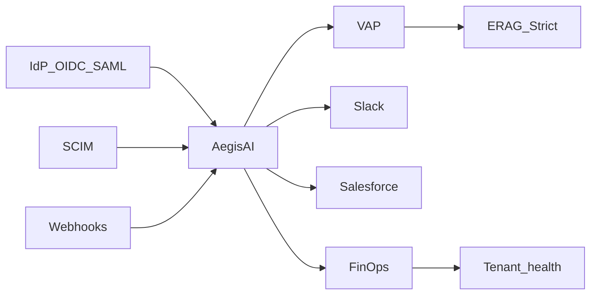

# Acme Support Agent Embed — FDE wedge

**Domain:** Forward Deployed · Customer embed · Governed agents  
**ADR:** [ADR-032](../adr/ADR-032-acme-support-agent-embed.md)  
**Method:** [fde-field-method.md](./fde-field-method.md) · Live: [venkat-ai.com/fde](https://venkat-ai.com/fde)  
**Proof level:** Demonstrated (spine wedge) — not Verified customer production traffic

## Problem

Platform catalogs don’t prove embed. FDE panels want identity, events, connectors, tenant health, and metering under real constraints — without another mega-product.

## What we decided

1. **One named wedge** — Acme support triage on the existing spine (ADR-032).
2. **Spine hosts the seams** — AegisAI (SSO/SCIM, webhooks, Slack/Salesforce, health, IR), Enterprise RAG Strict, agent-finops (+ Stripe test), VAP.
3. **Refuse** — CustomerOS repo, HubSpot/GWS packs, SOC2 theater, fake logos, soft tenancy as “RLS done.”

## Architecture

## Twelve moves — honest status

| # | Move | Host | Status |
|---|------|------|--------|
| 1 | Multi-tenant | AegisAI + FinOps `scope_type=tenant` | Demonstrated (not Postgres RLS) |
| 2 | Enterprise SSO | OIDC JWKS + SAML ACS + SCIM | Demonstrated |
| 3 | Connector pack | Slack retries/DLQ + Salesforce Case | Demonstrated; HubSpot/GWS adapter-only |
| 4 | Secure RAG | ERAG Strict + spoof-tenant | Satisfied→hardened |
| 5 | Customer health | `/api/tenants/{id}/health` UI | Demonstrated |
| 6 | Webhook engine | HMAC + idempotency + DLQ + replay | Demonstrated |
| 7 | One-click deploy | `scripts/embed_acme_up.sh` / `down.sh` | Demonstrated |
| 8 | PII middleware | Shared redact + compliance log | Demonstrated (pattern, not SOC2) |
| 9 | Incident response | Evidence pack + post-mortem + comms | Demonstrated |
| 10 | Usage metering | FinOps + Stripe test invoice preview | Demonstrated |
| 11 | Onboarding | Checklist + `ttfv_seconds` | Demonstrated |
| 12 | Public case study | This doc + `/fde` Embed lab | Satisfied→extended |

## Live proof

- Panel rubric: [ACME_EMBED_PANEL_RUBRIC.md](../docs/ACME_EMBED_PANEL_RUBRIC.md)
- **Operator wiring:** [ACME_EMBED_OPERATOR_WIRING.md](../docs/ACME_EMBED_OPERATOR_WIRING.md)
- Deploy: `aegisai-enterprise-agent-platform/scripts/embed_acme_up.sh`
- Adapter contract (refusals): `docs/ADAPTER_CONTRACT_HUBSPOT_GWS.md`
- IR drill: `docs/artifacts/acme-ir-drill-webhook-budget.md`
- Strict receipt: `enterprise_rag_platform/docs/artifacts/strict-receipts/`
- Spine health: https://venkat-ai.com/spine-health
- Portfolio Embed lab: https://venkat-ai.com/fde

## Failures & lessons

- Render Strict host 404 until Starter twin is provisioned — label Demo vs Strict everywhere.
- In-memory webhook DLQ is panel-ready; durable queue is Phase-2 enterprise.
- Brand stays Principal AI Architect · Forward Deployed — wedge lives under `/fde`, not home marketing.

## Related ADR

[ADR-032](../adr/ADR-032-acme-support-agent-embed.md) · [ADR-026](../adr/ADR-026-multi-tenant-isolation.md) · [ADR-030](../adr/ADR-030-fde-field-method-portfolio-proof.md)
