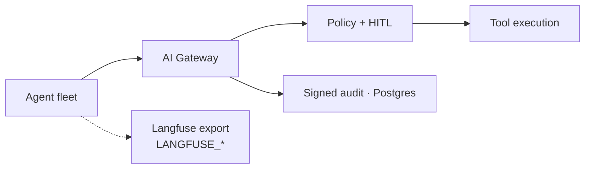

# AegisAI — Enterprise Agent Governance Control Plane

**Domain:** Agent governance · Runtime policy · HITL · Audit  
**Organization:** Open-source reference (portfolio)  
**Live demo:** [aegisai-enterprise-agent-platform.vercel.app](https://aegisai-enterprise-agent-platform.vercel.app)  
**Source:** [github.com/vpeetla-ai/aegisai-enterprise-agent-platform](https://github.com/vpeetla-ai/aegisai-enterprise-agent-platform)

## Problem

Building agents is easy. Governing them is the product. Enterprise programs need to answer: who is this agent, what tools may it call, when must a human approve, and can we prove what happened?

## Architecture

```text
Agent Request → Gateway SDK → OPA Policy → HITL Queue → Tool Execution → Signed Audit
                                    ↓
                            Agent Registry (Postgres)
                                    ↓
              Langfuse / LangSmith export (trace-linked eval adapters)
```



**Monitor → Govern → Remediate** — not another agent builder, but a runtime control plane in front of production agents.

## Key decisions

- Separate governance from orchestration (see [ADR-001](../adr/ADR-001-orchestration-vs-governance-split.md))
- Side-effecting calls require gateway + optional HITL ([ADR-004](../adr/ADR-004-gateway-hitl-side-effects.md))
- Agent registry with persistent lifecycle state

## Trade-offs

| Decision | Rationale |
|----------|-----------|
| Gateway SDK vs inline checks | Central policy enforcement across all integrated systems |
| HITL for high-risk only | Balance velocity vs safety |
| OPA for policy | Declarative, auditable rules — but advisory: fails open (allow) when OPA itself is unavailable, defaulting to a builtin simulator rather than a hard block |
| Cron orchestrator endpoints now require `AuthRequired` ([ADR-0003](https://github.com/vpeetla-ai/aegisai-enterprise-agent-platform/blob/main/adr/0003-orchestrator-auth-gate.md)) | They previously had no auth dependency at all, unlike every other mutating route — closes that inconsistency |
| MCP exposed outbound, not just gated inbound ([ADR-0005](https://github.com/vpeetla-ai/aegisai-enterprise-agent-platform/blob/main/adr/0005-mcp-tool-exposure.md) · [ADR-013](../adr/ADR-013-mcp-exposure-and-real-a2a-delegation.md)) | `McpGovernanceProxy` already gated outbound MCP calls; a real `interfaces/mcp/server.py` now exposes registry/budget/kill-switch/website-build as MCP tools any client can call, through the same governed core |
| Real AWS deploy alongside Render ([ADR-0006](https://github.com/vpeetla-ai/aegisai-enterprise-agent-platform/blob/main/adr/0006-paas-vs-iac-deploy-tradeoffs.md) · [ADR-015](../adr/ADR-015-real-aws-gcp-infra-phase-c.md)) | Chosen as the AWS target because this is the flagship control plane — real VPC/ECS Fargate/ALB/RDS/IAM, verified with a real orchestrator run against real RDS-backed persistence, then torn down |

## Stack

FastAPI · Next.js · Vercel · Render · Supabase/Postgres · AWS ECS/RDS/ALB (alternative deploy)

## Related

- Pairs with [Venkat AI Platform](./venkat-ai-platform.md)
- Essay: [From Multi-Agent OS to Agent Governance](./from-multi-agent-os-to-agent-governance.md)
