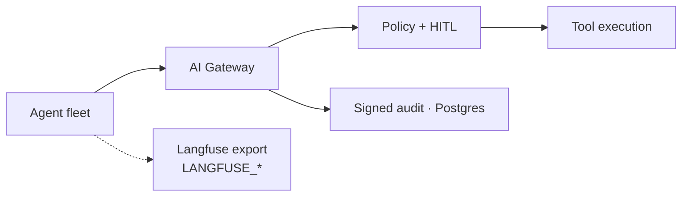

# AegisAI — Enterprise Agent Governance Control Plane

**Domain:** Agent governance · Runtime policy · HITL · Audit  
**Organization:** Open-source reference (portfolio)  
**Live demo:** [aegisai-enterprise-agent-platform.vercel.app](https://aegisai-enterprise-agent-platform.vercel.app)  
**Source:** [github.com/vpeetla-ai/aegisai-enterprise-agent-platform](https://github.com/vpeetla-ai/aegisai-enterprise-agent-platform)

## Problem

Building agents is easy. Governing them is the product. Enterprise programs need to answer: who is this agent, what tools may it call, when must a human approve, and can we prove what happened?

## Architecture

```text
Agent Request → Gateway SDK → OPA Policy → HITL Queue → Tool Execution → Signed Audit
                                    ↓
                            Agent Registry (Postgres)
                                    ↓
              Langfuse / LangSmith export (trace-linked eval adapters)
```



**Monitor → Govern → Remediate** — not another agent builder, but a runtime control plane in front of production agents.

## Key decisions

- Separate governance from orchestration (see [ADR-001](../architecture-decisions/001-orchestration-vs-governance-split.md))
- Side-effecting calls require gateway + optional HITL ([ADR-004](../architecture-decisions/004-gateway-hitl-side-effects.md))
- Agent registry with persistent lifecycle state

## Trade-offs

| Decision | Rationale |
|----------|-----------|
| Gateway SDK vs inline checks | Central policy enforcement across all integrated systems |
| HITL for high-risk only | Balance velocity vs safety |
| OPA for policy | Declarative, auditable rules |

## Stack

FastAPI · Next.js · Vercel · Render · Supabase/Postgres

## Related

- Pairs with [Venkat AI Platform](./venkat-ai-platform.md)
- Essay: [From Multi-Agent OS to Agent Governance](./from-multi-agent-os-to-agent-governance.md)
