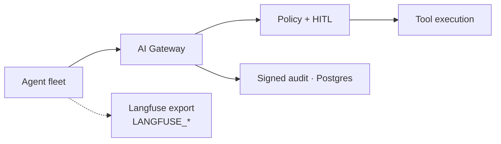

# AegisAI — Enterprise Agent Governance Control Plane

**Domain:** Agent governance · Runtime policy · HITL · Audit  
**Organization:** Open-source reference (portfolio)  
**Live demo:** [aegisai-enterprise-agent-platform.vercel.app](https://aegisai-enterprise-agent-platform.vercel.app)  
**Source:** [github.com/vpeetla-ai/aegisai-enterprise-agent-platform](https://github.com/vpeetla-ai/aegisai-enterprise-agent-platform)

## Problem

I can stand up an agent that calls tools in an afternoon. The scar shows up the first time something irreversible happens and nobody can answer: who was this agent, what was it allowed to do, did a human approve, and where’s the signed record? Building agents is easy. Governing them is the product.

## What we decided

1. **Governance stays out of the graph** — VAP orchestrates; AegisAI is the control plane. Merge them and every demo becomes an un-auditable back door ([ADR-001](../adr/ADR-001-orchestration-vs-governance-split.md)).
2. **Side effects go through the gateway** — policy first, optional HITL on the scary ones, signed audit always ([ADR-004](../adr/ADR-004-gateway-hitl-side-effects.md)).
3. **Agent registry with real lifecycle** — Postgres-backed identity and state, not a YAML wish list.
4. **Auth on cron/orchestrator routes** — those endpoints previously had no auth while every other mutating path did ([repo ADR-0003](https://github.com/vpeetla-ai/aegisai-enterprise-agent-platform/blob/main/adr/0003-orchestrator-auth-gate.md)).
5. **MCP both ways** — gate outbound calls *and* expose governed tools so clients hit the same core ([ADR-013](../adr/ADR-013-mcp-exposure-and-real-a2a-delegation.md) · [repo ADR-0005](https://github.com/vpeetla-ai/aegisai-enterprise-agent-platform/blob/main/adr/0005-mcp-tool-exposure.md)).

## Architecture

```text
Agent Request → Gateway SDK → OPA Policy → HITL Queue → Tool Execution → Signed Audit
                                    ↓
                            Agent Registry (Postgres)
                                    ↓
              Langfuse / LangSmith export (trace-linked eval adapters)
```


```mermaid
flowchart LR
    AG[Agent fleet] --> GW[AI Gateway]
    GW --> POL[Policy + HITL]
    POL --> EX[Tool execution]
    GW --> AUD[Signed audit · Postgres]
    AG -.-> LF[Langfuse export<br/>LANGFUSE_*]
```

Monitor → Govern → Remediate. Not another agent builder — a runtime control plane in front of production agents.

## Live proof

- UI: [aegisai-enterprise-agent-platform.vercel.app](https://aegisai-enterprise-agent-platform.vercel.app)
- Always-on spine is Render/Vercel. Real AWS (VPC/ECS/ALB/RDS) was stand-up → verify → tear-down ([ADR-015](../adr/ADR-015-real-aws-gcp-infra-phase-c.md) · [receipt case study](./aws-ephemeral-control-plane-receipt.md)).
- **Acme Support Agent Embed (ADR-032):** SSO/SCIM, HMAC webhooks+DLQ, Slack/Salesforce connectors, tenant health+TTFV, IR playbooks — [case study](./acme-support-agent-embed.md) · [operator wiring](../docs/ACME_EMBED_OPERATOR_WIRING.md) · harness `acme.embed_invariant_v1`

## Limitations / what we'd do differently

- OPA is advisory here: when OPA itself is down, the stack falls back to a builtin simulator rather than a hard block. Demo velocity won; `PRODUCTION_STRICT` is the honesty flag for panels ([ADR-024](../adr/ADR-024-production-strict-fail-closed.md)).
- Free-tier cold starts are real — don’t sell this as an enterprise SLO.
- Acme webhook DLQ is process-memory on Demo; durable queue is Phase-2 enterprise.
- I’d tighten fail-closed defaults for anything that looks like a production deploy path, and keep the simulator labeled as demo theater.

## Stack

FastAPI · Next.js · Vercel · Render · Supabase/Postgres · AWS ECS/RDS/ALB (ephemeral IaC path)

## Related

- Pairs with [Venkat AI Platform](./venkat-ai-platform.md)
- FDE wedge: [Acme Support Agent Embed](./acme-support-agent-embed.md) · [ADR-032](../adr/ADR-032-acme-support-agent-embed.md)
- Essay: [From Multi-Agent OS to Agent Governance](./from-multi-agent-os-to-agent-governance.md)
