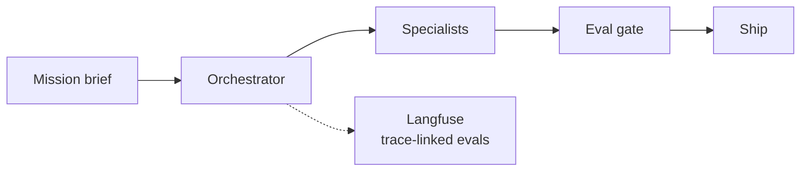

# AegisLoop — AgentOps Workbench

**Domain:** AgentOps · Mission fleets · Evaluation  
**Live demo:** [aegisloop-agentops-workbench.vercel.app](https://aegisloop-agentops-workbench.vercel.app)  
**Source:** [github.com/vpeetla-ai/aegisloop-agentops-workbench](https://github.com/vpeetla-ai/aegisloop-agentops-workbench)

## Problem

Orchestration demos do not model how agent **fleets** operate in production: bounded missions, specialist handoffs, trace observability, cost visibility, and human-gated ship.

## Architecture

Mission Brief → Orchestrator → Specialists → Source Coverage → Eval Gate → Ship (via AegisAI)

## Key capabilities

- Mission orchestrator with specialist routing
- Langfuse spans and replayable traces
- FinOps estimates per mission
- VAP delegation for complex sub-tasks

## Related ADR

[ADR-003: Mission-based AgentOps](../architecture-decisions/003-mission-based-agentops.md)

## Stack

FastAPI · Vercel · Render · Langfuse
