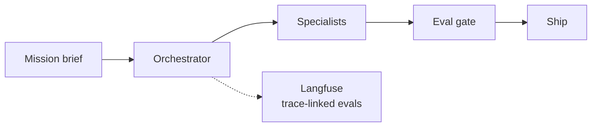

# AegisLoop — AgentOps Workbench

**Domain:** AgentOps · Mission fleets · Evaluation  
**Live demo:** [aegisloop-agentops-workbench.vercel.app](https://aegisloop-agentops-workbench.vercel.app)  
**Source:** [github.com/vpeetla-ai/aegisloop-agentops-workbench](https://github.com/vpeetla-ai/aegisloop-agentops-workbench)

## Problem

Orchestration demos do not model how agent **fleets** operate in production: bounded missions, specialist handoffs, trace observability, cost visibility, and human-gated ship.

## Architecture

Mission Brief → Orchestrator → Specialists → Source Coverage → Eval Gate → Ship (via AegisAI)

## Key capabilities

- Mission orchestrator with specialist routing
- Langfuse spans and replayable traces
- Real FinOps metering per mission (agent-finops), not an estimate
- VAP delegation for complex sub-tasks

## Trade-offs

| Choice | Rationale |
|--------|-----------|
| API-key gate on mission-run/stream, both backend and Netlify function ([ADR-010](../adr/ADR-010-aegisloop-auth-gate.md)) | Both entry points called a real LLM with zero caller auth — closed independently in each |
| Real usage metering + mission budget guard via agent-finops ([ADR-012](../adr/ADR-012-aegisloop-finops-metering.md)) | Replaced a character-count cost guess with real token counts and a real halt condition — no kill-switch here, so enforcement is refusing further dispatch, not a persistent block |

## Related ADR

[ADR-003: Mission-based AgentOps](../adr/ADR-003-mission-based-agentops.md) · [ADR-010: Auth gate on mission-run routes](../adr/ADR-010-aegisloop-auth-gate.md) · [ADR-012: Real FinOps metering](../adr/ADR-012-aegisloop-finops-metering.md)

## Stack

FastAPI · Vercel · Render · Langfuse
