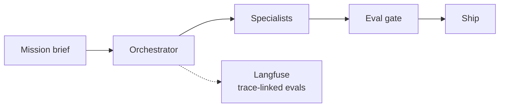

# AegisLoop — AgentOps Workbench

**Domain:** AgentOps · Mission fleets · Evaluation  
**Live demo:** [aegisloop-agentops-workbench.vercel.app](https://aegisloop-agentops-workbench.vercel.app)  
**Source:** [github.com/vpeetla-ai/aegisloop-agentops-workbench](https://github.com/vpeetla-ai/aegisloop-agentops-workbench)

## Problem

Orchestration demos don’t model fleets. The scar was a “FinOps” number that was character-count theater while the LLM client already returned real tokens — and mission-run endpoints that called a real model with zero caller auth, twice (FastAPI *and* Netlify). Fleets die without bounded missions, eval gates, and a halt that actually refuses dispatch.

## What we decided

1. **Mission-based AgentOps** — brief → orchestrator → specialists → eval gate → ship via AegisAI ([ADR-003](../adr/ADR-003-mission-based-agentops.md)).
2. **API-key on mission-run/stream in both entry points** — closed independently in backend and Netlify ([ADR-010](../adr/ADR-010-aegisloop-auth-gate.md)).
3. **Real FinOps metering** — token counts into agent-finops; budget breach refuses further dispatch (no persistent kill-switch here) ([ADR-012](../adr/ADR-012-aegisloop-finops-metering.md)).
4. **Real A2A before VAP invoke** — discover `agent-card` first; stop guessing the orchestrator from a local map ([ADR-013](../adr/ADR-013-mcp-exposure-and-real-a2a-delegation.md)).
5. **golden-eval-registry gates CI** — `aegisloop_mission_gates_v1` against real `runtime.evaluate()` ([ADR-014](../adr/ADR-014-golden-eval-registry-real-ci-gate.md)).

## Architecture

Mission Brief → Orchestrator → Specialists → Source Coverage → Eval Gate → Ship (via AegisAI)

```mermaid
flowchart LR
    MB[Mission brief] --> OR[Orchestrator] --> SP[Specialists] --> EV[Eval gate] --> SH[Ship]
    OR -.-> LF[Langfuse<br/>trace-linked evals]
```

## Live proof

- UI: [aegisloop-agentops-workbench.vercel.app](https://aegisloop-agentops-workbench.vercel.app)
- FinOps consumer wiring: [agent-finops.md](./agent-finops.md)

## Limitations / what we'd do differently

- Enforcement here is “refuse dispatch,” not a persistent kill-switch — AegisAI owns that shape. Dual semantics across consumers is honest but easy to mis-explain in a panel.
- Langfuse is the observability story; don’t imply always-on enterprise fleet SLOs on free tier.
- I’d unify budget-halt UX so operators see one vocabulary across AegisAI and AegisLoop.

## Stack

FastAPI · Vercel · Render · Langfuse

## Related ADR

[ADR-003](../adr/ADR-003-mission-based-agentops.md) · [ADR-010](../adr/ADR-010-aegisloop-auth-gate.md) · [ADR-012](../adr/ADR-012-aegisloop-finops-metering.md) · [ADR-013](../adr/ADR-013-mcp-exposure-and-real-a2a-delegation.md) · [ADR-014](../adr/ADR-014-golden-eval-registry-real-ci-gate.md)
