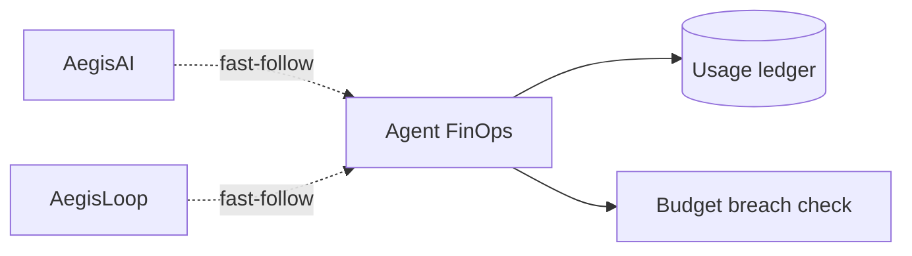

# Agent FinOps — Real Cost Governance, Not a Seeded Dashboard

**Domain:** Cost governance · Usage metering · Budget enforcement
**Source:** [github.com/vpeetla-ai/agent-finops](https://github.com/vpeetla-ai/agent-finops)

## Problem

Two platforms in this org (AegisAI, AegisLoop) shipped a "FinOps" module that looked real but
wasn't: cost computed from seeded or guessed numbers, never the provider's own real token usage,
even though both LLM clients already receive that data and discard it. A self-audit found this
gap and traced it directly to the same failure mode the org's own Substack essay warns about:
"AI cost is not a finance problem. It is an architecture problem."

## Architecture

```text
Consumer's real LLM call → real (prompt_tokens, completion_tokens) from the provider response
  → agent_finops_client.record_usage(...)
  → FastAPI ledger: real $ cost (one canonical pricing table) + running total vs. budget
  → {breached: bool} returned — consumer decides enforcement, this service doesn't
```



## Key decisions

- Standalone repo, not embedded logic — matches how every other capability in this org (VAP,
  AegisAI, Enterprise RAG, AegisLoop) is already its own single-purpose repo.
- Reports cost truth; does not enforce. AegisAI's real kill-switch and AegisLoop's dispatch
  guard stay local — this service doesn't reach into another repo's control plane.
- SDK degrades gracefully to a local pricing estimate when unconfigured, so no consumer
  hard-fails on this being unavailable.

## Trade-offs

| Choice | Why | Cost |
|--------|-----|------|
| Standalone service vs. embedded per-repo logic ([ADR-011](../adr/ADR-011-agent-finops-standalone-service.md)) | One pricing table; enables real cross-tenant totals | Consumers must wire an HTTP call |
| Report breach, don't enforce | Each consumer's enforcement mechanism already differs | Consumers must remember to act on it |
| Built standalone first, consumers wired as follow-up ([ADR-012](../adr/ADR-012-aegisloop-finops-metering.md)) | Proves the service works before integrating | Both AegisAI and AegisLoop are now wired as real consumers — no longer a pending follow-up |
| Real GCP deploy path alongside Render ([ADR-015](../adr/ADR-015-real-aws-gcp-infra-phase-c.md)) | Genuine hands-on Cloud Run + Cloud SQL infra ownership, not just a PaaS deploy | Real, temporary cloud spend — stood up, verified, torn down, not left running |

## Impact

- Same documentation discipline as every other repo (honest status table, ADR, architecture/
  product docs, demo, CI) — this is what "portfolio truthfulness" (Phase 1 of
  `ORG_IMPROVEMENT_PLAN_2026.md`) is supposed to produce when caught early.
- Verified end-to-end against a live running instance during the build, not just unit-mocked —
  recorded real usage, set a budget, confirmed breach detection over real HTTP requests.
- Directly closes the loop on the org's own Substack thesis: the audit that found this gap is
  itself the proof the article's argument was right.
- Real GCP infra ownership, not just a service: `terraform apply` stood up Cloud Run + Cloud
  SQL for real, a real budget breach was detected against the live Cloud SQL-backed ledger, and
  `terraform destroy` cleanly tore everything down — verified with the provider's own CLI, not
  assumed.

## Related

- [ADR-011: AgentFinOps standalone service](../adr/ADR-011-agent-finops-standalone-service.md)
- [ADR-012: Real FinOps metering wired into both consumers](../adr/ADR-012-aegisloop-finops-metering.md)
- [ADR-015: Genuine hands-on AWS + GCP infra](../adr/ADR-015-real-aws-gcp-infra-phase-c.md)
- [ORG_IMPROVEMENT_PLAN_2026.md](../docs/ORG_IMPROVEMENT_PLAN_2026.md) Phase 7
- [agent-finops](https://github.com/vpeetla-ai/agent-finops)
