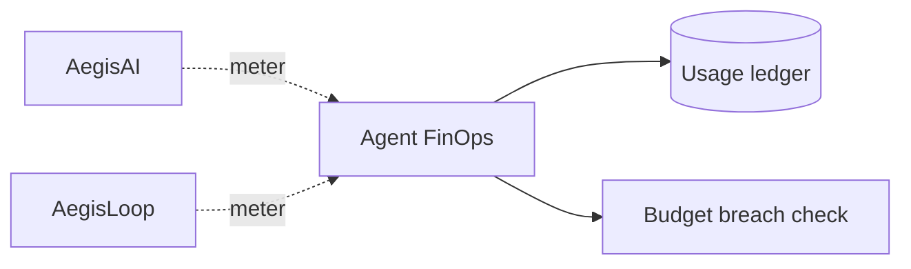

# Agent FinOps — Real Cost Governance, Not a Seeded Dashboard

**Domain:** Cost governance · Usage metering · Budget enforcement  
**Live demo:** [agent-finops.vercel.app](https://agent-finops.vercel.app) · [API](https://agent-finops-api.onrender.com)  
**Source:** [github.com/vpeetla-ai/agent-finops](https://github.com/vpeetla-ai/agent-finops)

## Problem

AegisAI and AegisLoop both shipped a “FinOps” module that looked real and wasn’t. Cost came from seeded or guessed numbers while both LLM clients already received real token counts — and discarded them. Self-audit found it. Same failure mode the Substack piece warns about: AI cost isn’t a finance problem; it’s an architecture problem.

## What we decided

1. **Standalone service, one ledger** — not another per-repo fragment ([ADR-011](../adr/ADR-011-agent-finops-standalone-service.md)).
2. **Report truth; consumers enforce** — return `{breached}`; AegisAI kill-switch and AegisLoop dispatch guard stay local.
3. **Canonical pricing table** — one place for $, not three drifting spreadsheets.
4. **Wire consumers as follow-up, then actually wire them** — AegisAI and AegisLoop now meter for real ([ADR-012](../adr/ADR-012-aegisloop-finops-metering.md)).
5. **GCP receipt path** — Cloud Run + Cloud SQL stand-up → breach against live ledger → destroy ([ADR-015](../adr/ADR-015-real-aws-gcp-infra-phase-c.md)).

## Architecture

```text
Consumer's real LLM call → real (prompt_tokens, completion_tokens) from the provider response
  → agent_finops_client.record_usage(...)
  → FastAPI ledger: real $ cost (one canonical pricing table) + running total vs. budget
  → {breached: bool} returned — consumer decides enforcement, this service doesn't
```


```mermaid
flowchart LR
  A[AegisAI] -.->|meter| FO[Agent FinOps]
  L[AegisLoop] -.->|meter| FO
  FO --> LEDGER[(Usage ledger)]
  FO --> BUDGET[Budget breach check]
```

## Live proof

- UI: [agent-finops.vercel.app](https://agent-finops.vercel.app)
- API: [agent-finops-api.onrender.com](https://agent-finops-api.onrender.com)
- GCP receipts: [gcp-serverless-ai-platform-receipt.md](./gcp-serverless-ai-platform-receipt.md)
- Spine metering step: [golden-path-spine-e2e.md](./golden-path-spine-e2e.md)

## Limitations / what we'd do differently

- SDK falls back to a local pricing estimate when unconfigured — demos don’t hard-fail, but that estimate isn’t ledger truth. Label it.
- Consumers must remember to act on `breached`; the service won’t reach into another control plane.
- Cloud SQL is ephemeral for receipts — destroy or stop when not verifying; don’t leave billable always-on SQL for a free-tier story.

## Related

- [ADR-011](../adr/ADR-011-agent-finops-standalone-service.md) · [ADR-012](../adr/ADR-012-aegisloop-finops-metering.md) · [ADR-015](../adr/ADR-015-real-aws-gcp-infra-phase-c.md)
- [ORG_IMPROVEMENT_PLAN_2026.md](../docs/ORG_IMPROVEMENT_PLAN_2026.md) Phase 7
