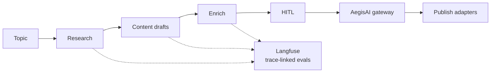

# AI Content Factory — Governed Content Pipeline

**Domain:** Content automation · Multi-agent · HITL publish  
**Live demo:** [ai-content-factory-iota.vercel.app](https://ai-content-factory-iota.vercel.app)  
**Source:** [github.com/vpeetla-ai/ai-content-factory](https://github.com/vpeetla-ai/ai-content-factory)

## Problem

Marketing and content teams need **one topic → many platforms** without losing brand control. Single-prompt tools skip research depth, skip human approval, and create compliance risk when agents post autonomously.

**Who we serve:** Content leads, marketing ops, and platform engineers building governed publish pipelines.

## Architecture

```text
Topic → Research (RAG) → Content (5 drafts) → Enrich (SEO/visual)
      → HITL interrupt → Human approve/edit → AegisAI Gateway → Publish
```



## Key decisions

- LangGraph with `interrupt_before=["hitl"]` — irreversible step gated by humans
- AegisAI `authorize_publish()` before OAuth adapters
- In-process MCP bridge for read-only research tools; publish via `PublisherService`
- pytest on graph, HITL, and gateway paths

## Trade-offs

| Decision | Rationale | Cost |
|----------|-----------|------|
| HITL mandatory | Trust + policy | Not overnight-autonomous (by design) |
| Real OAuth + PKCE for LinkedIn/X only ([ADR-008](../adr/ADR-008-real-publish-scope-and-invite-gating.md)) | Only two platforms have a viable public posting API | Medium/Substack/Instagram are copy-draft export, not auto-publish |
| Invite-gated signup, no billing yet | Ship to real users without building billing prematurely | Revisit monetization once there's usage data |
| Redis checkpointer | Resume long pipelines | Ops dependency |
| Gateway fail-open dev | Local velocity | Fail-closed required in prod |

## Stack

FastAPI · LangGraph · Next.js · Clerk · Redis · Vercel · Render

## Related

- [PRODUCT.md](https://github.com/vpeetla-ai/ai-content-factory/blob/main/docs/PRODUCT.md) in repo
- [ADR-008: Real publish scope and invite-gating](../adr/ADR-008-real-publish-scope-and-invite-gating.md)
- [AegisAI case study](./aegisai-agent-governance.md) — gateway layer
- Essay: [2026 Agent Protocol Stack](https://github.com/vpeetla-ai/ai-content-factory/blob/main/docs/content/2026-agent-protocol-stack.md)
