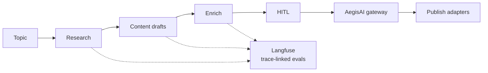

# AI Content Factory — Governed Content Pipeline

**Domain:** Content automation · Multi-agent · HITL publish  
**Live demo:** [ai-content-factory-iota.vercel.app](https://ai-content-factory-iota.vercel.app)  
**Source:** [github.com/vpeetla-ai/ai-content-factory](https://github.com/vpeetla-ai/ai-content-factory)

## Problem

One topic should become many platform drafts — without an agent posting to LinkedIn while you’re asleep. The scar is autonomous publish: research skipped, brand voice lost, and no human in the irreversible step. Marketing ops won’t trust that, and neither should a platform engineer.

## What we decided

1. **HITL interrupt before publish** — LangGraph `interrupt_before=["hitl"]`; overnight-autonomous was an explicit refusal.
2. **AegisAI `authorize_publish()` before OAuth adapters** — the graph drafts; the gateway owns the side effect ([ADR-004](../adr/ADR-004-gateway-hitl-side-effects.md)).
3. **Real OAuth + PKCE for LinkedIn/X only** — only those two have a viable public posting API; Medium/Substack/Instagram stay copy-draft export ([ADR-008](../adr/ADR-008-real-publish-scope-and-invite-gating.md)).
4. **Invite-gated signup, no billing yet** — ship to real users before monetization theater.
5. **pytest on graph, HITL, and gateway paths** — regression where the irreversible step lives.

## Architecture

```text
Topic → Research (RAG) → Content (5 drafts) → Enrich (SEO/visual)
      → HITL interrupt → Human approve/edit → AegisAI Gateway → Publish
```


```mermaid
flowchart LR
  T[Topic] --> R[Research]
  R --> C[Content drafts]
  C --> E[Enrich]
  E --> H[HITL]
  H --> G[AegisAI gateway]
  G --> P[Publish adapters]
  R & C & E -.-> LF[Langfuse<br/>trace-linked evals]
```

## Live proof

- UI: [ai-content-factory-iota.vercel.app](https://ai-content-factory-iota.vercel.app)
- Product brief: [PRODUCT.md](https://github.com/vpeetla-ai/ai-content-factory/blob/main/docs/PRODUCT.md)
- Golden path uses `/health` for the app layer (live publish needs Clerk).

## Limitations / what we'd do differently

- Gateway fail-open is fine for local velocity; fail-closed is required before any real OAuth credentials sit in a shared env.
- Redis checkpointer adds an ops dependency — worth it for resume, painful on free tier.
- I’d add billing only after invite usage data exists, and I’d keep “copy-draft export” platforms labeled so nobody thinks Instagram auto-posts.

## Stack

FastAPI · LangGraph · Next.js · Clerk · Redis · Vercel · Render

## Related

- [ADR-008: Real publish scope and invite-gating](../adr/ADR-008-real-publish-scope-and-invite-gating.md)
- [AegisAI case study](./aegisai-agent-governance.md)
- Essay: [2026 Agent Protocol Stack](https://github.com/vpeetla-ai/ai-content-factory/blob/main/docs/content/2026-agent-protocol-stack.md)
