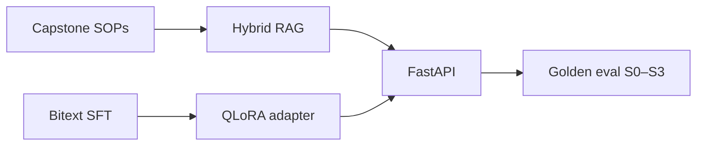

# DomainForge — Enterprise RAG + PEFT Triage Pipeline

**Domain:** Enterprise RAG · Parameter-efficient fine-tuning · Eval harness  
**Live demo:** [domainforge-rag-peft.vercel.app](https://domainforge-rag-peft.vercel.app)  
**API:** [domainforge-api.onrender.com](https://domainforge-api.onrender.com)  
**Source:** [domainforge-rag-peft](https://github.com/vpeetla-ai/domainforge-rag-peft)

## Problem

Support automation needs **grounded citations** from SOPs and **reliable JSON** for routing — base models hallucinate field names and invent `chunk_id`s. A single "fine-tune everything" or "RAG only" approach fails one dimension or the other.

## Architecture

```text
SOP corpus → chunk + index → hybrid retriever (S1/S2)
Bitext SFT → ChatML → QLoRA adapter (S3)
Both → FastAPI /v1/query → eval harness (S0–S3 compare)
```



## Key decisions

- **RAG = facts, PEFT = behavior** — separate data planes, separate eval metrics ([ADR-019](../adr/ADR-019-rag-facts-peft-behavior.md))
- **Solution ladder** — S0 baseline → S1 naive RAG → S2 hybrid → S3 PEFT+hybrid → **S4 DPO-aligned**; compare via `/v1/eval/compare`
- **DPO preference pairs** — scorer-labeled chosen vs hard-negative rejected ([ADR-020](../adr/ADR-020-dpo-after-sft-alignment.md))
- **Adapter promotion gated** — `promote` endpoint requires API key; blocked on faithfulness or format regression
- **Honest production scope** — Render runs `MOCK_LLM=true`; full Mistral QLoRA requires CUDA

## Trade-offs

| Decision | Rationale |
|----------|-----------|
| Capstone SOP corpus (13 docs) | Portfolio-safe; no employer supply-chain data |
| Bitext public SFT | Realistic intent distribution without proprietary tickets |
| Hybrid BM25 + lexical (S2) | Better recall than naive cosine-only RAG |
| Public query/eval endpoints | Portfolio demo UX on free tier |
| API-key on promote only | Governance for irreversible adapter changes |

## Impact

- Tenth production platform in the governed stack — answers **"How do we adapt models to domain format?"**
- Interview narrative: *"RAG for facts · SFT for schema · DPO for alignment"*
- 32 pytest cases; live S0–S4 compare + preference pair viewer
- Pairs with [Enterprise RAG](enterprise-rag-platform.md) (access layer) and [vLLM Architecture Lab](vllm-architecture-lab.md) (inference education)

## Stack

Python 3.11 · FastAPI · Chroma · TRL · PEFT · Next.js static export · Vercel · Render

## Related ADR

[ADR-019: RAG facts + PEFT behavior](../adr/ADR-019-rag-facts-peft-behavior.md) · [ADR-020: DPO after SFT](../adr/ADR-020-dpo-after-sft-alignment.md) · [ADR-002: Authorization before ranking](../adr/ADR-002-authorization-before-ranking-rag.md)
