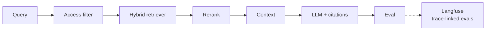

# Enterprise RAG Platform — Access-Aware Knowledge Layer

**Domain:** Enterprise RAG · Hybrid retrieval · Governance  
**Live demo:** [demo-omega-taupe.vercel.app](https://demo-omega-taupe.vercel.app)  
**Source:** [github.com/vpeetla-ai/enterprise_rag_platform](https://github.com/vpeetla-ai/enterprise_rag_platform)

## Problem

Production RAG is not "connect a vector DB." Enterprise knowledge requires access control, citation traceability, evaluation gates, and integration with governance for ingest and high-risk answers.

## Architecture

```text
Query + Principal → Access Filter → Hybrid Retriever → Reranker → Graph Expand
       → Context Assembly → LLM + Citations → Eval/HITL → Langfuse export
```



## Key outcome

Authorization **before** semantic ranking — not after generation.

## Trade-offs

| Decision | Rationale |
|----------|-----------|
| Access filter first | Prevent unauthorized content in context window |
| Hybrid lexical + semantic | Recall for exact terms and paraphrase |
| AegisAI HITL bridge | High-risk ingest and answer paths |
| Seeded demo corpus | Portfolio demo without mandatory vector DB |
| API-key gate, Principal still client-asserted ([ADR-0004](https://github.com/vpeetla-ai/enterprise_rag_platform/blob/main/docs/adr/0004-api-auth-and-principal-trust.md)) | Closes "anyone can call the API" but not "anyone can claim any identity in the request body" — the access-before-ranking guarantee holds only given a trustworthy Principal, which a real deployment must derive from a verified token |

## Related ADR

[ADR-002: Authorization before ranking](../architecture-decisions/002-authorization-before-ranking-rag.md) · [ADR-0004: API auth and principal trust](https://github.com/vpeetla-ai/enterprise_rag_platform/blob/main/docs/adr/0004-api-auth-and-principal-trust.md)

## Stack

FastAPI · Docker · Vercel · Render · Qdrant (optional)
