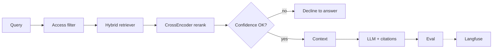

# Enterprise RAG Platform — Access-Aware Knowledge Layer

**Domain:** Enterprise RAG · Hybrid retrieval · Governance  
**Live demo:** [enterprise-rag-platform-eta.vercel.app](https://enterprise-rag-platform-eta.vercel.app)  
**Source:** [enterprise_rag_platform](https://github.com/vpeetla-ai/enterprise_rag_platform)

## Problem

Production RAG is not "connect a vector DB." Enterprise knowledge requires access control, citation traceability, evaluation gates, and integration with governance for ingest and high-risk answers.

## Architecture

Canonical: [docs/diagrams/canonical-architecture.mmd](https://github.com/vpeetla-ai/enterprise_rag_platform/blob/main/docs/diagrams/canonical-architecture.mmd)

```text
Query + Principal → Access Filter → Hybrid Retriever → CrossEncoder Rerank
       → Decline if low confidence → Context → LLM + Citations → Eval/HITL → Langfuse
```



## Key outcome

Authorization **before** semantic ranking — then rerank, then **decline** when evidence is insufficient.

## Trade-offs

| Decision | Rationale |
|----------|-----------|
| Access filter first | Prevent unauthorized content in context window |
| Hybrid lexical + semantic | Recall for exact terms and paraphrase |
| Cross-encoder rerank | ms-marco-MiniLM after hybrid recall |
| Decline-to-answer | `RAG_DECLINE_THRESHOLD` — no hallucinated synthesis |
| AegisAI HITL bridge | High-risk ingest and answer paths |
| golden-eval-registry CI gate | Real regression on isolated `RagPipeline` |

## Related ADR

[ADR-002: Authorization before ranking](../adr/ADR-002-authorization-before-ranking-rag.md) · [ADR-023: Rerank + decline](../adr/ADR-023-enterprise-rag-rerank-decline.md) · [ADR-014: Golden eval CI gate](../adr/ADR-014-golden-eval-registry-real-ci-gate.md)

## Stack

FastAPI · Docker · Vercel · Render · Qdrant (optional)
