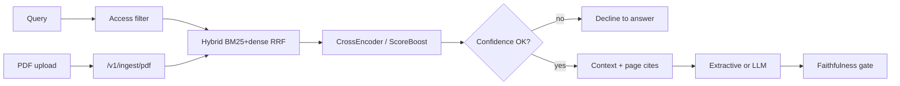

# Enterprise RAG Platform — Access-Aware Knowledge Layer

**Domain:** Enterprise RAG · PDF Q&A · Hybrid retrieval · Governance  
**Live demo:** [enterprise-rag-platform-eta.vercel.app](https://enterprise-rag-platform-eta.vercel.app)  
**Source:** [enterprise_rag_platform](https://github.com/vpeetla-ai/enterprise_rag_platform)  
**Program:** [TOP1PCT_ERAG_PROGRAM](https://github.com/vpeetla-ai/enterprise_rag_platform/blob/main/docs/TOP1PCT_ERAG_PROGRAM.md) · [Profiles](https://github.com/vpeetla-ai/enterprise_rag_platform/blob/main/docs/PROFILES.md)

## Problem

“Connect a vector DB” is how demos look smart and prod leaks. The scar is ranking unauthorized neighbors into the context window — or inventing `citations[0]` when evidence is weak. Enterprise PDF Q&A needs page cites, real hybrid recall, access *before* ranking, and the spine to decline.

## What we decided

1. **Authorization before ranking** — filter by who the caller is, then retrieve ([ADR-002](../adr/ADR-002-authorization-before-ranking-rag.md)).
2. **Page-aware server ingest** — client flatten destroys page numbers ([ERAG ADR-0007](https://github.com/vpeetla-ai/enterprise_rag_platform/blob/main/docs/adr/0007-page-aware-ingest-and-citations.md)).
3. **BM25 + dense + RRF, then rerank** — dual-signal recall; cross-encoder on Strict, ScoreBoost on slim Demo ([ADR-023](../adr/ADR-023-enterprise-rag-rerank-decline.md) · [ERAG ADR-0008](https://github.com/vpeetla-ai/enterprise_rag_platform/blob/main/docs/adr/0008-dual-demo-strict-retrieval-profiles.md)).
4. **Decline beats fake cites** — empty citations over spoofed ones when confidence or faithfulness fails.
5. **Golden eval as a real CI gate** — `enterprise_rag_golden_v1` against an isolated `RagPipeline`; first run found a real fixture bug ([ADR-014](../adr/ADR-014-golden-eval-registry-real-ci-gate.md)).

## Architecture

Canonical: [docs/diagrams/canonical-architecture.mmd](https://github.com/vpeetla-ai/enterprise_rag_platform/blob/main/docs/diagrams/canonical-architecture.mmd)

```text
PDF → /v1/ingest/pdf (page-aware) → ACL-tagged chunks
Query + Principal → Access Filter → BM25 + dense + RRF → CE rerank
       → Decline if low confidence / unfaithful → Grounded answer + page citations → Langfuse
```


```mermaid
flowchart LR
    PDF[PDF upload] --> ING["/v1/ingest/pdf"]
    Q[Query] --> AF[Access filter] --> RET["Hybrid BM25+dense RRF"]
    RET --> RR[CrossEncoder / ScoreBoost] --> DEC{Confidence OK?}
    DEC -->|no| REF[Decline to answer]
    DEC -->|yes| CTX[Context + page cites] --> GEN[Extractive or LLM]
    GEN --> FAITH[Faithfulness gate]
    ING --> RET
```

## Live proof

- UI: [enterprise-rag-platform-eta.vercel.app](https://enterprise-rag-platform-eta.vercel.app)
- Spine answer step: [golden-path-spine-e2e.md](./golden-path-spine-e2e.md)
- Interview drills: [02 RAG at scale](https://ai-architect-interview-playbook.vercel.app/q/ai-system-design/02-rag-platform-at-scale/) · [22 PDF Q&A](https://ai-architect-interview-playbook.vercel.app/q/ai-system-design/22-enterprise-pdf-qa-citations-and-grounding/) · [23 Hybrid RRF](https://ai-architect-interview-playbook.vercel.app/q/ai-system-design/23-enterprise-hybrid-retrieval-and-access-aware-ranking/)

## Limitations / what we'd do differently

- Demo vs Strict is intentional dual posture — cheap Demo; JWT+exp Strict for panels. Don’t confuse Demo recall with Strict trust.
- Qdrant and sentence-transformers are optional / Strict-image; free-tier memory backends are for receipts, not always-on enterprise search.
- I’d push more adversarial principal-spoof cases into every consumer CI, not only the registry suite.

## Stack

FastAPI · PyMuPDF · Docker · Vercel · Render · Qdrant (optional) · sentence-transformers (Strict image)

## Related ADR

[ADR-002](../adr/ADR-002-authorization-before-ranking-rag.md) · [ADR-023](../adr/ADR-023-enterprise-rag-rerank-decline.md) · [ADR-014](../adr/ADR-014-golden-eval-registry-real-ci-gate.md) · ERAG [ADR-0007](https://github.com/vpeetla-ai/enterprise_rag_platform/blob/main/docs/adr/0007-page-aware-ingest-and-citations.md) · [ADR-0008](https://github.com/vpeetla-ai/enterprise_rag_platform/blob/main/docs/adr/0008-dual-demo-strict-retrieval-profiles.md)
