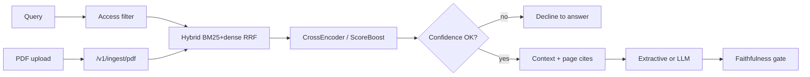

# Enterprise RAG Platform — Access-Aware Knowledge Layer

**Domain:** Enterprise RAG · PDF Q&A · Hybrid retrieval · Governance  
**Live demo:** [enterprise-rag-platform-eta.vercel.app](https://enterprise-rag-platform-eta.vercel.app)  
**Source:** [enterprise_rag_platform](https://github.com/vpeetla-ai/enterprise_rag_platform)  
**Program:** [TOP1PCT_ERAG_PROGRAM](https://github.com/vpeetla-ai/enterprise_rag_platform/blob/main/docs/TOP1PCT_ERAG_PROGRAM.md) · [Profiles](https://github.com/vpeetla-ai/enterprise_rag_platform/blob/main/docs/PROFILES.md)

## Problem

Production RAG is not "connect a vector DB." Enterprise PDF Q&A needs page-specific citations, hybrid retrieval that is not lexical theater, access control before ranking, and decline when evidence is weak — plus Demo vs Strict principal trust for panels.

## Architecture

Canonical: [docs/diagrams/canonical-architecture.mmd](https://github.com/vpeetla-ai/enterprise_rag_platform/blob/main/docs/diagrams/canonical-architecture.mmd)

```text
PDF → /v1/ingest/pdf (page-aware) → ACL-tagged chunks
Query + Principal → Access Filter → BM25 + dense + RRF → CE rerank
       → Decline if low confidence / unfaithful → Grounded answer + page citations → Langfuse
```


```mermaid
flowchart LR
    PDF[PDF upload] --> ING["/v1/ingest/pdf"]
    Q[Query] --> AF[Access filter] --> RET["Hybrid BM25+dense RRF"]
    RET --> RR[CrossEncoder / ScoreBoost] --> DEC{Confidence OK?}
    DEC -->|no| REF[Decline to answer]
    DEC -->|yes| CTX[Context + page cites] --> GEN[Extractive or LLM]
    GEN --> FAITH[Faithfulness gate]
    ING --> RET
```

## Key outcome

Authorization **before** semantic ranking — page structure preserved through ingest — RRF fusion — then **decline** (score or faithfulness) instead of inventing citations.

## Trade-offs

| Decision | Rationale |
|----------|-----------|
| Access filter first | Prevent unauthorized content in context window |
| Server PDF ingest | Client flatten destroys page numbers (ADR-0007) |
| BM25 + dense + RRF | Real dual-signal; not Jaccard-as-semantic |
| Cross-encoder on Strict image | ScoreBoost only for slim Demo |
| Decline + no cite spoof | Empty citations beat fake `citations[0]` |
| Demo vs Strict dual posture | Cheap Demo; JWT+exp Strict for panels (ADR-0006/0009) |
| AegisAI HITL bridge | High-risk ingest and answer paths |
| golden-eval-registry CI gate | Real regression on isolated `RagPipeline` |

## Interview drill

- [02 RAG at scale](https://ai-architect-interview-playbook.vercel.app/q/ai-system-design/02-rag-platform-at-scale/)
- [22 PDF Q&A citations](https://ai-architect-interview-playbook.vercel.app/q/ai-system-design/22-enterprise-pdf-qa-citations-and-grounding/)
- [23 Hybrid RRF](https://ai-architect-interview-playbook.vercel.app/q/ai-system-design/23-enterprise-hybrid-retrieval-and-access-aware-ranking/)

## Related ADR

[ADR-002: Authorization before ranking](../adr/ADR-002-authorization-before-ranking-rag.md) · [ADR-023: Rerank + decline](../adr/ADR-023-enterprise-rag-rerank-decline.md) · [ADR-014: Golden eval CI gate](../adr/ADR-014-golden-eval-registry-real-ci-gate.md) · ERAG [ADR-0007](https://github.com/vpeetla-ai/enterprise_rag_platform/blob/main/docs/adr/0007-page-aware-ingest-and-citations.md) · [ADR-0008](https://github.com/vpeetla-ai/enterprise_rag_platform/blob/main/docs/adr/0008-dual-demo-strict-retrieval-profiles.md)

## Stack

FastAPI · PyMuPDF · Docker · Vercel · Render · Qdrant (optional) · sentence-transformers (Strict image)
