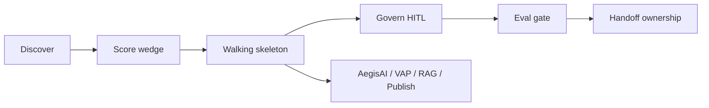

# Case study: FDE Field Method

## Problem
AI Architect portfolios often look like **platform catalogs**. FDE interviews fail candidates who jump to architecture before clarifying the customer's workflow, constraints, and irreversible actions. We needed dual-fit proof: Principal architecture depth **and** Forward Deployed delivery — without inventing a sixth mega-platform or fake external logos.

## Architecture (method, not another service)

## Key decisions

1. **Method over mega-product** — [ADR-030](../adr/ADR-030-fde-field-method-portfolio-proof.md)
2. **Internal customer honesty** — Lucid Supply Chain / Commerce as embed proof; open repos are O reference, not employer product claims
3. **Week-1 questions before architecture** — jobs, systems of record, SSO/ACLs, irreversibility, change windows, exit owner
4. **Wedge scoring** — value × feasibility × risk × reuse × named sponsor
5. **Playbook dual track** — `fde-deployment/` covers Why FDE, decomposition, discovery→MVP, client simulation

## Live demo
- Method page: https://venkat-ai.com/fde
- Spine review: https://venkat-ai.com/technical-review
- Playbook FDE pack: https://github.com/vpeetla-ai/ai-architect-interview-playbook/blob/main/release/fde_pack.json

## What we'd do differently
- Add a take-home-style public artifact (tiny RAG + eval notes) once coding mocks are weekly habit
- Publish one anonymized discovery notes template after a real FDE loop (with legal review)

## Status
**Implemented** as portfolio + curriculum method. Candidate voice practice remains the readiness gate.
