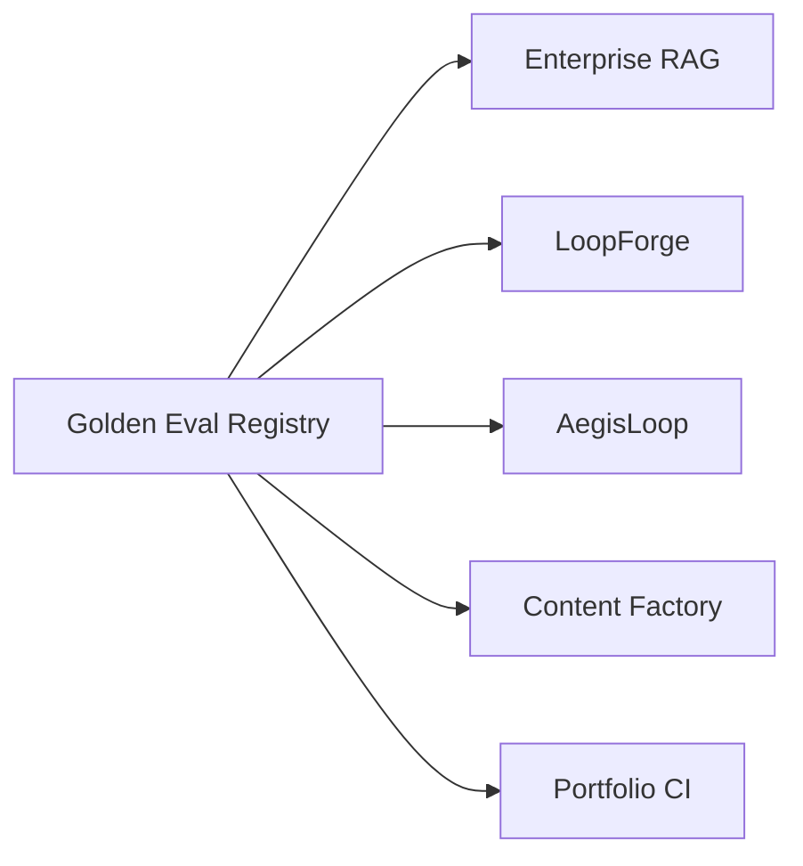

# Golden Eval Registry — Cross-Repo Regression Contracts

**Domain:** Agent evals · Regression safety · Portfolio proof  
**Source:** [github.com/vpeetla-ai/golden-eval-registry](https://github.com/vpeetla-ai/golden-eval-registry)

## Problem

The org had strong local tests, but the evaluation contracts were scattered: Enterprise RAG golden queries, LoopForge benchmark items, AegisLoop mission gates, and Content Factory HITL states lived in separate repos.

Hiring panels and platform reviewers need to inspect **what must not regress** across the whole stack, not just click live demos.

## Architecture

```text
Golden Eval Registry
  -> versioned suite manifests
  -> JSONL golden cases
  -> dependency-light validator
  -> consumer repos import and execute locally
```



## Key decisions

- Registry owns fixture shape and versioning; consumer repos own execution.
- JSON/JSONL avoids runtime dependencies and keeps diffs readable.
- `locked: true` mirrors Karpathy's eval-harness rule: agents must not silently edit metrics they are trying to pass.

## Trade-offs

| Choice | Why | Cost |
|--------|-----|------|
| Fixture registry first | Safe cross-repo value | No full cross-repo runner yet |
| No live LLM/API calls | Deterministic CI | Does not prove live service health |
| Consumer-owned execution | Keeps repo boundaries clean | Requires adapter work per repo |

## Impact

- Fifth proof surface after live demos, ADRs, honest status tables, and skills.
- Makes "evals as product" concrete across the governed agent stack.
- Provides importable suites for Enterprise RAG, LoopForge, AegisLoop, and Content Factory.

## Related

- [ORG_REVIEW_2026](../docs/ORG_REVIEW_2026.md)
- [ADR-007 Agent Protocol Stack](../adr/ADR-007-2026-agent-protocol-stack.md)
- [golden-eval-registry](https://github.com/vpeetla-ai/golden-eval-registry)
