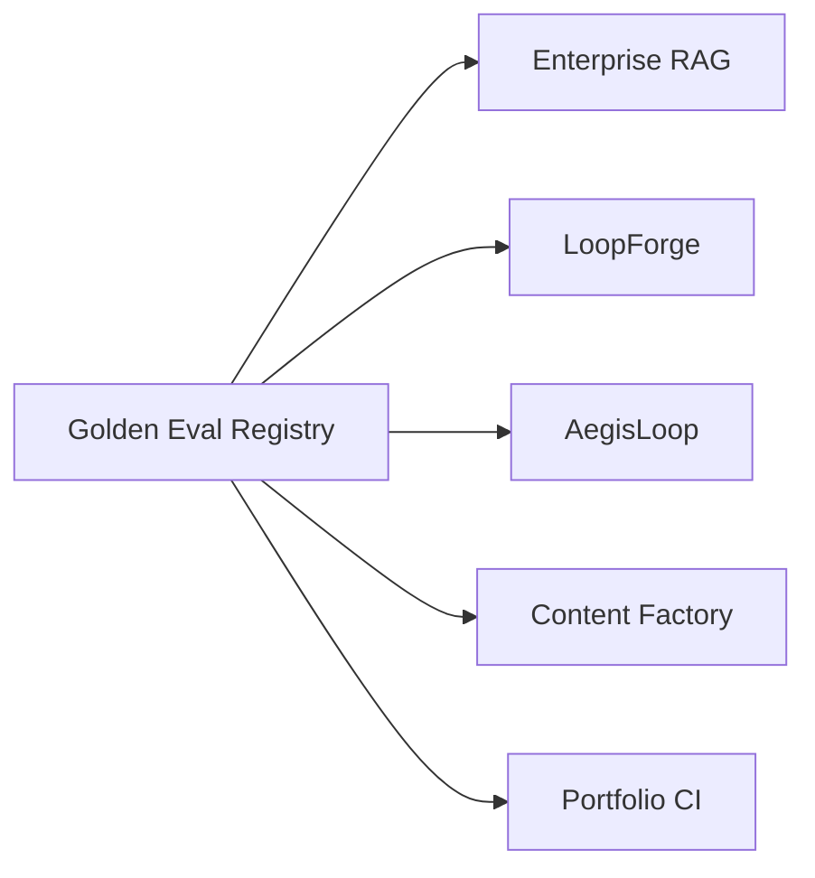

# Golden Eval Registry — Cross-Repo Regression Contracts

**Domain:** Agent evals · Regression safety · Portfolio proof  
**Source:** [github.com/vpeetla-ai/golden-eval-registry](https://github.com/vpeetla-ai/golden-eval-registry)

## Problem

The org had strong local tests, but the evaluation contracts were scattered: Enterprise RAG golden queries, LoopForge benchmark items, AegisLoop mission gates, and Content Factory HITL states lived in separate repos.

Hiring panels and platform reviewers need to inspect **what must not regress** across the whole stack, not just click live demos.

## Architecture

```text
Golden Eval Registry
  -> versioned suite manifests
  -> JSONL golden cases
  -> dependency-light validator
  -> consumer repos import and execute locally
```



## Key decisions

- Registry owns fixture shape and versioning; consumer repos own execution.
- JSON/JSONL avoids runtime dependencies and keeps diffs readable.
- `locked: true` mirrors Karpathy's eval-harness rule: agents must not silently edit metrics they are trying to pass.

## Trade-offs

| Choice | Why | Cost |
|--------|-----|------|
| Fixture registry first, then real scorers ([ADR-0002](https://github.com/vpeetla-ai/golden-eval-registry/blob/main/docs/adr/0002-real-scorer-and-first-ci-gate.md)) | Safe cross-repo value first; real execution once the shape proved out | 4 of 6 suite kinds are still fixture-validation only |
| No live LLM/API calls in the registry itself | Deterministic, dependency-light scoring logic | The registry can't prove live service health on its own — that's each consumer's job |
| Consumer-owned execution | Keeps repo boundaries clean; registry never gains provider-specific client code | Requires adapter work per repo |

## Impact

- Fifth proof surface after live demos, ADRs, honest status tables, and skills.
- Makes "evals as product" concrete across the governed agent stack.
- Provides importable suites for Enterprise RAG, LoopForge, AegisLoop, and Content Factory.
- **Two suites now gate real CI builds**, not just validate fixtures: `enterprise_rag_golden_v1`
  runs against `enterprise_rag_platform`'s real, isolated `RagPipeline`; `aegisloop_mission_gates_v1`
  runs against `aegisloop-agentops-workbench`'s real `runtime.evaluate()` gate. Running the RAG
  suite for the first time immediately surfaced a real bug in its own corpus fixture — direct
  proof that fixture existence and fixture correctness are different claims (see ADR-0002 above
  and [ADR-014](../adr/ADR-014-golden-eval-registry-real-ci-gate.md)).

## Related

- [ORG_REVIEW_2026](../docs/ORG_REVIEW_2026.md)
- [ADR-007 Agent Protocol Stack](../adr/ADR-007-2026-agent-protocol-stack.md)
- [ADR-014: Real scorer + first CI gates](../adr/ADR-014-golden-eval-registry-real-ci-gate.md)
- [golden-eval-registry](https://github.com/vpeetla-ai/golden-eval-registry)
