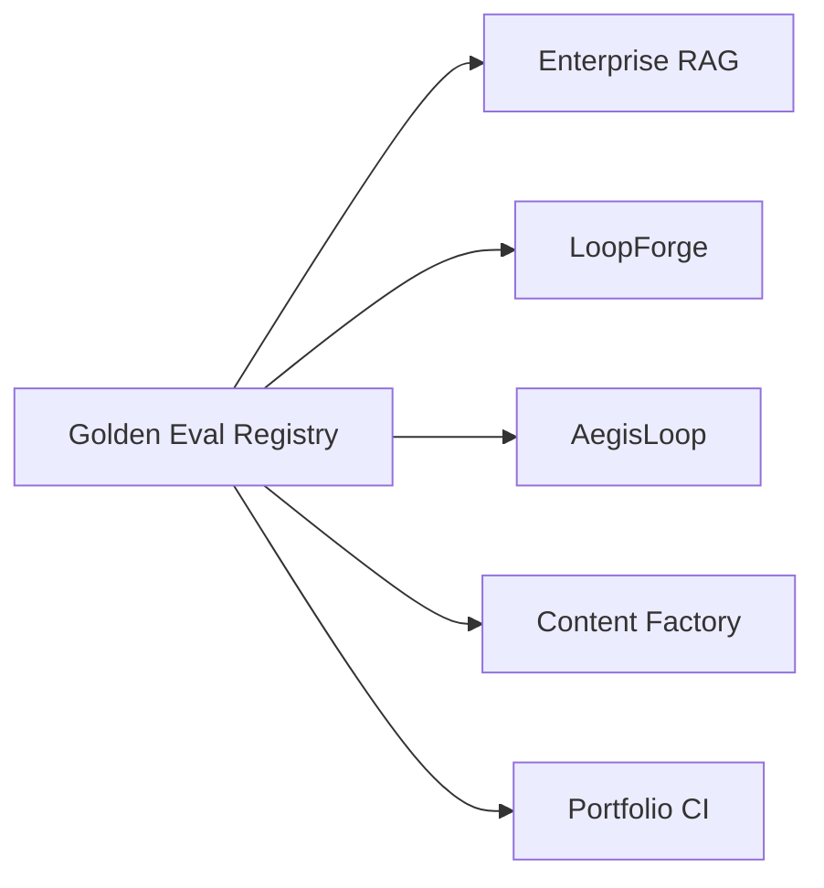

# Golden Eval Registry — Cross-Repo Regression Contracts

**Domain:** Agent evals · Regression safety · Portfolio proof  
**Source:** [github.com/vpeetla-ai/golden-eval-registry](https://github.com/vpeetla-ai/golden-eval-registry)  
**CI:** [](https://github.com/vpeetla-ai/golden-eval-registry/actions/workflows/ci.yml)

## Problem

Local tests were strong; the *contracts* were scattered. Enterprise RAG goldens, LoopForge benches, AegisLoop mission gates, Content Factory HITL states — each repo owned a private idea of “must not regress.” Hiring panels can’t inspect that by clicking demos. The scar: fixture existence ≠ fixture correctness — the first real RAG suite run found a bug in its own corpus.

## What we decided

1. **Registry owns shape + versioning; consumers own execution** — clean repo boundaries.
2. **JSON/JSONL fixtures** — readable diffs, no heavy runtime deps in the registry.
3. **`locked: true`** — agents don’t silently edit the metrics they’re trying to pass.
4. **Fixture registry first, then real scorers** — safe cross-repo value, then gate CI ([repo ADR-0002](https://github.com/vpeetla-ai/golden-eval-registry/blob/main/docs/adr/0002-real-scorer-and-first-ci-gate.md) · [ADR-014](../adr/ADR-014-golden-eval-registry-real-ci-gate.md)).
5. **No live LLM calls inside the registry** — deterministic; live health stays each consumer’s job.

## Architecture

```text
Golden Eval Registry
  -> versioned suite manifests
  -> JSONL golden cases
  -> dependency-light validator
  -> consumer repos import and execute locally
```


```mermaid
flowchart LR
  GER["Golden Eval Registry"]
  RAG["Enterprise RAG"]
  LF["LoopForge"]
  AL["AegisLoop"]
  ACF["Content Factory"]
  PF["Portfolio CI"]

  GER --> RAG
  GER --> LF
  GER --> AL
  GER --> ACF
  GER --> PF
```

## Live proof

- Repo + CI: [golden-eval-registry](https://github.com/vpeetla-ai/golden-eval-registry)
- Real CI gates today: `enterprise_rag_golden_v1` → isolated `RagPipeline`; `aegisloop_mission_gates_v1` → real `runtime.evaluate()`

## Limitations / what we'd do differently

- Four of six suite kinds are still fixture-validation only — don’t oversell “every suite gates production behavior.”
- Adapter work per consumer is the tax for clean boundaries.
- Next: promote more suites from validate-only to real scorer gates without bloating the registry with provider clients.

## Related

- [ADR-007](../adr/ADR-007-2026-agent-protocol-stack.md) · [ADR-014](../adr/ADR-014-golden-eval-registry-real-ci-gate.md)
- [ORG_REVIEW_2026](../docs/ORG_REVIEW_2026.md)
