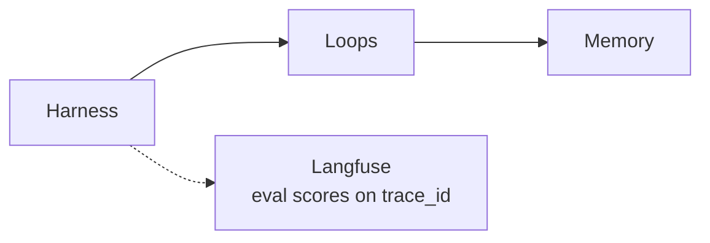

# LoopForge — Self-Improving Agent Harness

**Domain:** Loop engineering · Applied AI  
**Live demo:** [demo-omega-taupe.vercel.app](https://demo-omega-taupe.vercel.app)  
**API:** [loopforge-api.onrender.com](https://loopforge-api.onrender.com)  
**Source:** [loop-engine-agent-platform](https://github.com/vpeetla-ai/loop-engine-agent-platform)

## Problem

Static RAG configs and one-shot agents do not improve. Teams need agents that **fix real codebases** — with eval gates, memory, and governance-friendly PR workflow (never direct push to `main`).

## Architecture

```text
Agent → Harness → Loops → Memory
         ↓
    Langfuse (trace-linked evals: system · trace · node)
```



Three production loops:

| Loop | Flow | API |
|------|------|-----|
| **ODAEU harness** | RAG retrieve → ReAct → eval → evolve config | `POST /api/run` |
| **LangGraph coding** | Orchestrator → Code → Review → Quality → retry/HITL | `POST /api/agent-loop` |
| **Repo fix → PR** | clone → pytest → patch → branch → GitHub PR | `POST /api/repo-fix` |

| Component | Role |
|-----------|------|
| **Harness** | ODAEU scheduler, iteration budget, trace export |
| **LangGraph** | Multi-agent coding loop with conditional routing |
| **Workspace** | Git clone, pytest, branch, GitHub PR API |
| **Memory** | Procedural lessons + RAG config version tree |
| **MCP** | Corpus tools — extensible to stdio MCP servers |

## Key decisions

- Separate harness from agent — MemPro, MUSE, Harness Engineering
- **PR-based ship path** — `loopforge/fix-{run_id}` branch, never push to `main`
- RAG pipeline as evolvable config (`top_k`, `hybrid_alpha`, `rerank_threshold`)
- Groq LLM + GitHub token on Render for live repo fixes

## Trade-offs

| Choice | Why | Cost |
|--------|-----|------|
| JSON file memory (v1) | Zero-infra demo on free tier | Not multi-tenant |
| pytest-only quality gate (v1) | Works on Python repos today | Node/Rust need adapters |
| Render free tier | $0 API hosting | Cold start ~30–60s |

## Impact

- Sixth layer of governed AI reference stack: **How do agents improve?**
- Live demo recruiters can click: paste repo URL → open PR
- Portfolio flagship for loop engineering + applied AI at frontier labs

## Stack

Python · LangGraph · FastAPI · MCP · Groq · GitHub API · Vercel · Render

## Related

- [Architecture](https://github.com/vpeetla-ai/loop-engine-agent-platform/blob/main/docs/ARCHITECTURE.md)
- [ADR-001](https://github.com/vpeetla-ai/loop-engine-agent-platform/blob/main/docs/ADR-001-loop-harness-memory.md)
- Pairs with [VAP](https://github.com/vpeetla-ai/venkat-ai-platform), [Enterprise RAG](https://github.com/vpeetla-ai/enterprise_rag_platform), [AegisAI](https://github.com/vpeetla-ai/aegisai-enterprise-agent-platform)
