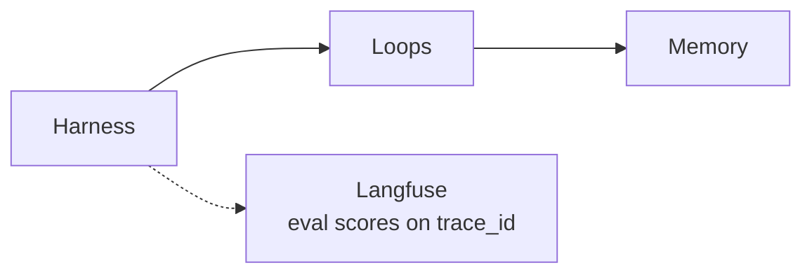

# LoopForge — Self-Improving Agent Harness

**Domain:** Loop engineering · Applied AI  
**Live demo:** [demo-omega-taupe.vercel.app](https://demo-omega-taupe.vercel.app)  
**API:** [loopforge-api.onrender.com](https://loopforge-api.onrender.com)  
**Source:** [loop-engine-agent-platform](https://github.com/vpeetla-ai/loop-engine-agent-platform)

## Problem

Static RAG configs and one-shot agents don’t improve. The scar I’d refuse to ship again: an agent that “fixes” a repo by pushing straight to `main`, or a `/api/repo-fix` that clones and runs arbitrary code with nobody authenticated. Self-improvement without a harness, eval gate, and PR path is just unsupervised vandalism.

## What we decided

1. **Harness separate from the agent** — Agent → Harness → Loops → Memory ([org ADR-006](../adr/ADR-006-loop-harness-self-improving-agents.md) · [repo ADR-001](https://github.com/vpeetla-ai/loop-engine-agent-platform/blob/main/docs/ADR-001-loop-harness-memory.md)).
2. **PR-based ship only** — branch `loopforge/fix-{run_id}`, never push to `main`.
3. **RAG config as evolvable state** — `top_k`, `hybrid_alpha`, `rerank_threshold` version with the loop, not hardcoded forever.
4. **API-key on repo-fix first** — close “who can trigger it” before container isolation ([repo ADR-002](https://github.com/vpeetla-ai/loop-engine-agent-platform/blob/main/docs/ADR-002-repo-fix-auth-and-isolation.md)).
5. **Three live loops** — ODAEU harness, LangGraph coding loop, repo-fix → GitHub PR.

## Architecture

```text
Agent → Harness → Loops → Memory
         ↓
    Langfuse (trace-linked evals: system · trace · node)
```


```mermaid
flowchart LR
    H[Harness] --> L[Loops] --> M[Memory]
    H -.-> LF[Langfuse<br/>eval scores on trace_id]
```

| Loop | Flow | API |
|------|------|-----|
| **ODAEU harness** | RAG retrieve → ReAct → eval → evolve config | `POST /api/run` |
| **LangGraph coding** | Orchestrator → Code → Review → Quality → retry/HITL | `POST /api/agent-loop` |
| **Repo fix → PR** | clone → pytest → patch → branch → GitHub PR | `POST /api/repo-fix` |

## Live proof

- UI: [demo-omega-taupe.vercel.app](https://demo-omega-taupe.vercel.app)
- API health: [loopforge-api.onrender.com](https://loopforge-api.onrender.com)
- Architecture: [docs/ARCHITECTURE.md](https://github.com/vpeetla-ai/loop-engine-agent-platform/blob/main/docs/ARCHITECTURE.md)

## Limitations / what we'd do differently

- JSON file memory (v1) is fine for free-tier demo, not multi-tenant.
- pytest-only quality gate — Node/Rust need adapters.
- Render cold start ~30–60s; if `LOOPFORGE_API_KEY` isn’t set on the live deploy, repo-fix stays open — that’s operator debt, not a solved security claim.
- Next: container isolation for cloned code; don’t pretend API-key alone is enough.

## Stack

Python · LangGraph · FastAPI · MCP · Groq · GitHub API · Vercel · Render

## Related

- [repo ADR-001](https://github.com/vpeetla-ai/loop-engine-agent-platform/blob/main/docs/ADR-001-loop-harness-memory.md) · [repo ADR-002](https://github.com/vpeetla-ai/loop-engine-agent-platform/blob/main/docs/ADR-002-repo-fix-auth-and-isolation.md)
- Pairs with [VAP](./venkat-ai-platform.md), [Enterprise RAG](./enterprise-rag-platform.md), [AegisAI](./aegisai-agent-governance.md)
