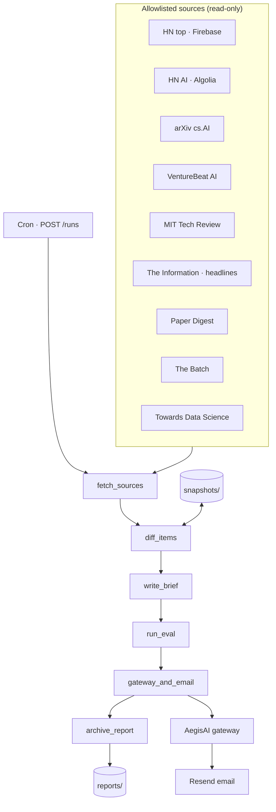

# Sentinel Brief — Governed Overnight Intelligence

**Domain:** Governed autonomy · Overnight agents · Intelligence brief  
**Source:** [github.com/vpeetla-ai/sentinel-brief](https://github.com/vpeetla-ai/sentinel-brief)

## Problem

Principal architects track AI signal across Hacker News, arXiv, industry press, and newsletters — nine tabs every morning. An overnight agent can fetch and summarize, but **email is a side effect** and must stay governed.

## Architecture

## Key decisions

| Decision | Rationale |
|----------|-----------|
| LangGraph linear pipeline | Testable nodes, matches org orchestration pattern |
| RSS/API only (MVP) | Stable ingest; Playwright deferred per ADR-0001 |
| Eval before email | Autonomous inner loop; block low-quality sends |
| Gateway on `email.send` only | Fetch is read-only — no gateway overhead |
| Paywalled = headline only | Honest access for The Information |

## Trade-offs

| Choice | Upside | Downside |
|--------|--------|----------|
| Template brief MVP | Zero LLM cost, deterministic tests | Less narrative synthesis |
| JSON snapshots | Portable, simple | No cross-source dedup yet |
| Min-delta eval | Reduces noise emails | Quiet news days may skip send |
| Fail-open gateway (dev) | Fast iteration | Must disable in production |

## Sources (v1)

HN top, HN AI (Algolia), arXiv cs.AI, VentureBeat AI, MIT Technology Review, The Information (partial), Paper Digest, The Batch, Towards Data Science.

## Impact

- Seventeenth org repo — proof of **LOOPS overnight harness** with governance boundary
- Complements Content Factory (publish) with **notify** pattern
- Portfolio demo: architecture tabs + report archive API

## Related

- [ADR-0001 Governed overnight brief](https://github.com/vpeetla-ai/sentinel-brief/blob/main/docs/adr/0001-governed-overnight-brief.md)
- [agents-that-run-for-days skill](https://github.com/vpeetla-ai/vpeetla-ai-skills)
- [Golden Eval Registry](golden-eval-registry.md)
