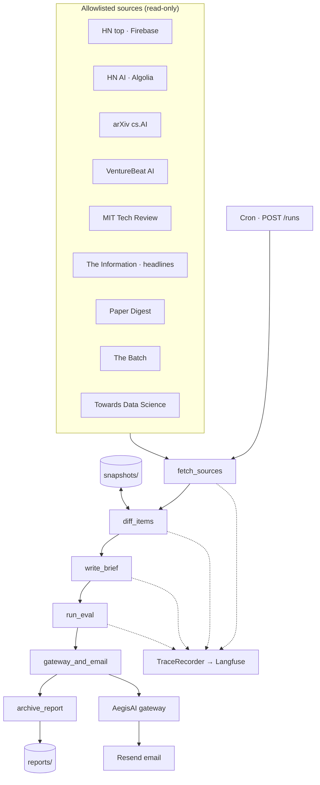

# Sentinel Brief — Governed Overnight Intelligence

**Domain:** Governed autonomy · Overnight agents · Intelligence brief  
**Live demo:** [sentinel-brief-ruddy.vercel.app](https://sentinel-brief-ruddy.vercel.app)  
**Source:** [github.com/vpeetla-ai/sentinel-brief](https://github.com/vpeetla-ai/sentinel-brief)

## Problem

Nine tabs every morning — HN, arXiv, press, newsletters. An overnight agent can fetch and summarize. The scar is treating **email as just another node**: once you send, you can’t un-send a bad brief into someone’s inbox. Fetch is read-only; `email.send` is the side effect that must stay governed.

## What we decided

1. **LangGraph linear pipeline** — fetch → diff → brief → eval → gateway+email → archive; testable nodes ([repo ADR-0001](https://github.com/vpeetla-ai/sentinel-brief/blob/main/docs/adr/0001-governed-overnight-brief.md)).
2. **Allowlisted RSS/API only (MVP)** — Playwright deferred; stable ingest over scrapers that break weekly.
3. **Eval before email** — autonomous inner loop; block low-quality or no-delta sends.
4. **Gateway only on `email.send`** — don’t tax read-only fetch with policy overhead.
5. **API-key on `POST /runs`** — archive stays browsable; triggering a run doesn’t ([repo ADR-0002](https://github.com/vpeetla-ai/sentinel-brief/blob/main/docs/adr/0002-runs-auth-and-llm-synthesis.md)).

## Architecture

```mermaid
flowchart TB
  CRON["Cron · POST /runs"] --> FETCH[fetch_sources]
  FETCH --> DIFF[diff_items]
  DIFF --> BRIEF[write_brief]
  BRIEF --> EVAL[run_eval]
  EVAL --> GW[gateway_and_email]
  GW --> ARCH[archive_report]

  subgraph sources["Allowlisted sources (read-only)"]
    HN1[HN top · Firebase]
    HN2[HN AI · Algolia]
    ARX[arXiv cs.AI]
    VB[VentureBeat AI]
    MIT[MIT Tech Review]
    INFO[The Information · headlines]
    PD[Paper Digest]
    BATCH[The Batch]
    TDS[Towards Data Science]
  end

  sources --> FETCH
  SNAP[(snapshots/)] <--> DIFF
  ARCH --> REP[(reports/)]
  GW --> AEGIS[AegisAI gateway] --> MAIL[Resend email]
  FETCH & DIFF & BRIEF & EVAL -.-> OBS["TraceRecorder → Langfuse"]
```

## Live proof

- UI: [sentinel-brief-ruddy.vercel.app](https://sentinel-brief-ruddy.vercel.app)
- Complements [AI Content Factory](./ai-content-factory.md) (publish) with a **notify** pattern.

## Limitations / what we'd do differently

- Paywalled sources (The Information) are headline-only — honest access, thinner signal.
- JSON snapshots are portable; cross-source dedup isn’t there yet.
- Fail-open gateway is fine for iteration; must be disabled before any production Resend key.
- Quiet news days may skip send by design (min-delta) — that’s a product choice, not a bug.
- Set `SENTINEL_API_KEY` on Render before calling this a production deployment.

## Related

- [ADR-0001](https://github.com/vpeetla-ai/sentinel-brief/blob/main/docs/adr/0001-governed-overnight-brief.md) · [ADR-0002](https://github.com/vpeetla-ai/sentinel-brief/blob/main/docs/adr/0002-runs-auth-and-llm-synthesis.md)
- [Golden Eval Registry](./golden-eval-registry.md)
