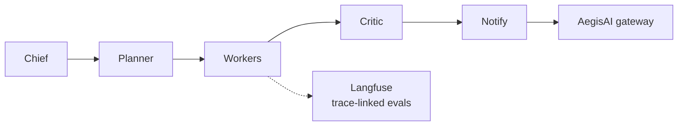

# Venkat AI Platform — Multi-Agent Orchestration OS

**Domain:** Multi-agent orchestration · RAG · Loop patterns  
**Live demo:** [venkat-ai-platform.vercel.app](https://venkat-ai-platform.vercel.app)  
**Source:** [github.com/vpeetla-ai/venkat-ai-platform](https://github.com/vpeetla-ai/venkat-ai-platform)

## Problem

Single-prompt chatbots cannot model how principal architects work: route intent, decompose into parallel workstreams, critique before delivery, and fan out to channels.

## Architecture

```text
Chief → Planner → Parallel Specialists → Content → Insight → Critic → Notify
         ↓              ↓
    7 RAG strategies   Loop patterns (ReAct · Reflection · Plan-Execute)
         ↓
    AegisAI Gateway (notify channels)
         ↓
    Langfuse (system / trace / node spans + eval scores)
```



Three LangGraph orchestrators: **Platform · Deep Research · Architecture Review**

## Key outcomes

- 16 routed intents with specialist agents
- Enterprise RAG adapter as 7th retrieval strategy
- Gateway-wrapped delivery to Slack, Telegram, WhatsApp

## Trade-offs

| Decision | Rationale |
|----------|-----------|
| LangGraph over linear chains | Stateful orchestration for enterprise workflows |
| Separate orchestrators | Different evaluation and tool boundaries per use case |
| Gateway at notify boundary | Side effects governed without coupling to orchestrator code |

## Stack

FastAPI · LangGraph · Next.js · Postgres · Qdrant · Vercel · Render

## Related ADR

[ADR-001: Orchestration vs governance split](../architecture-decisions/001-orchestration-vs-governance-split.md)
