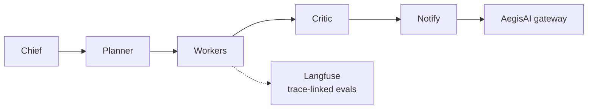

# Venkat AI Platform — Multi-Agent Orchestration OS

**Domain:** Multi-agent orchestration · RAG · Loop patterns  
**Live demo:** [venkat-ai-platform.vercel.app](https://venkat-ai-platform.vercel.app)  
**Source:** [github.com/vpeetla-ai/venkat-ai-platform](https://github.com/vpeetla-ai/venkat-ai-platform)

## Problem

A single prompt can’t model how I actually work: route intent, fan work to specialists, critique before anyone sees it, then notify a channel. Chatbot demos collapse that into one call — and then someone wires Slack from inside the graph with no auth. That’s the scar that forced the auth gate.

## What we decided

1. **LangGraph orchestrators, not linear chains** — Platform, Deep Research, and Architecture Review each own their own eval and tool boundary.
2. **Governance at the notify edge** — Slack / Telegram / WhatsApp go through AegisAI; the graph doesn’t get a side-effect back door ([ADR-001](../adr/ADR-001-orchestration-vs-governance-split.md)).
3. **API-key gate on chat / orchestrator / ingest / rag / threads** — those routes previously had zero auth while calling an LLM, writing vectors, or sending real messages ([ADR-009](../adr/ADR-009-vap-auth-gate.md)).
4. **Seven retrieval strategies** — including an Enterprise RAG adapter, so “knowledge” isn’t a hardcoded toy corpus.
5. **Refused:** merging gateway policy into the orchestrator so demos look simpler.

## Architecture

```text
Chief → Planner → Parallel Specialists → Content → Insight → Critic → Notify
         ↓              ↓
    7 RAG strategies   Loop patterns (ReAct · Reflection · Plan-Execute)
         ↓
    AegisAI Gateway (notify channels)
         ↓
    Langfuse (system / trace / node spans + eval scores)
```


```mermaid
flowchart LR
    CH[Chief] --> PL[Planner] --> WK[Workers] --> CR[Critic] --> NT[Notify]
    WK -.-> LF[Langfuse<br/>trace-linked evals]
    NT --> GW[AegisAI gateway]
```

## Live proof

- UI: [venkat-ai-platform.vercel.app](https://venkat-ai-platform.vercel.app)
- Spine ask step in [golden-path-spine-e2e.md](./golden-path-spine-e2e.md) (keyed `/chat` returns 200; persistence is best-effort if Postgres is down).

## Limitations / what we'd do differently

- Chat persistence is best-effort — ephemeral 200 when Postgres is unavailable (documented in platform PR #3). I’d make persistence failure louder in Strict mode.
- Free-tier cold starts; not a multi-region SLO story.
- I’d push more golden-eval coverage onto the orchestrator paths themselves, not only the RAG and mission siblings.

## Stack

FastAPI · LangGraph · Next.js · Postgres · Qdrant · Vercel · Render

## Related ADR

[ADR-001: Orchestration vs governance split](../adr/ADR-001-orchestration-vs-governance-split.md) · [ADR-009: Auth gate on VAP routes](../adr/ADR-009-vap-auth-gate.md)
