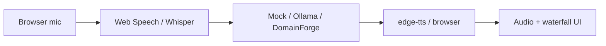

# VoiceForge — Real-Time Voice Triage Pipeline

**Domain:** Multimodal voice · ASR · LLM · TTS · Latency engineering  
**Live demo:** [voiceforge-assistant.vercel.app](https://voiceforge-assistant.vercel.app)  
**API:** [voiceforge-api-eysb.onrender.com](https://voiceforge-api-eysb.onrender.com)  
**Source:** [voiceforge-assistant](https://github.com/vpeetla-ai/voiceforge-assistant)

## Problem

Voice assistants must meet **sub-30s end-to-end latency** with visible phase breakdowns and fallbacks when ASR, LLM, or TTS fail. Chat-only demos do not prove multimodal production discipline.

## Architecture

```text
Mic (browser) → ASR → LLM triage → TTS → speaker
                    ↓
              LatencyBudget + DegradationReason
```



## Key decisions

- **Browser-first ASR on free tier** — Render cannot host Whisper by default ([ADR-021](../adr/ADR-021-voiceforge-multimodal-pipeline.md))
- **Pluggable LLM** — mock for demos; DomainForge for governed triage JSON
- **Graceful degradation** — text input, browser TTS, cached reply on timeout/failure
- **Dual transport** — REST for curl/tests; WebSocket for phase events

## Trade-offs

| Decision | Rationale |
|----------|-----------|
| Browser ASR default | Zero server GPU; honest Render free-tier story |
| edge-tts server TTS | Works without API keys on Render |
| Mock LLM in production demo | No cold-start GPU dependency |
| Latency waterfall in UI | Portfolio proof of performance engineering |

## Impact

- **Closes Portfolio Pillar 5** — real-time multimodal with measurable latency
- Pairs with [DomainForge](domainforge-rag-peft.md) (voice → triage JSON)
- 9 pytest cases; WebSocket + REST APIs

## Stack

Python 3.11 · FastAPI · edge-tts · Next.js static export · Vercel · Render

## Related ADR

[ADR-021: VoiceForge multimodal pipeline](../adr/ADR-021-voiceforge-multimodal-pipeline.md)
